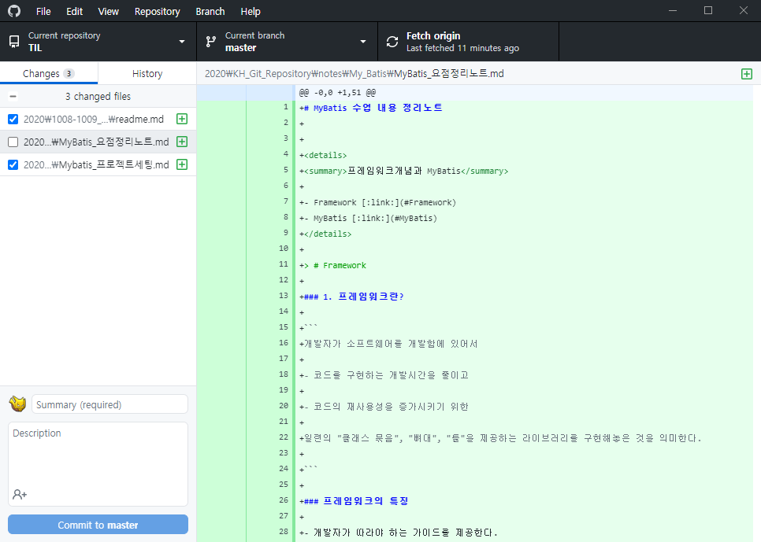
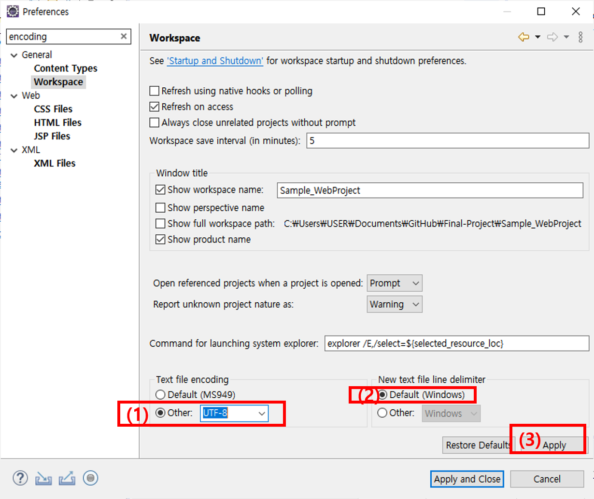
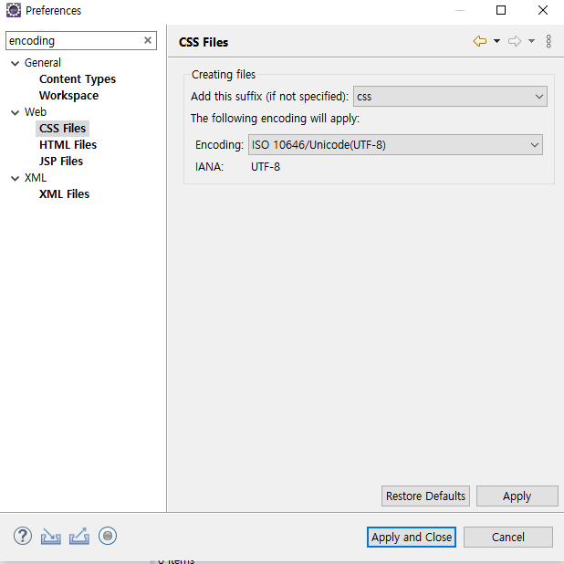
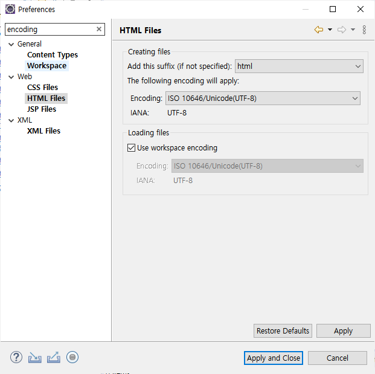
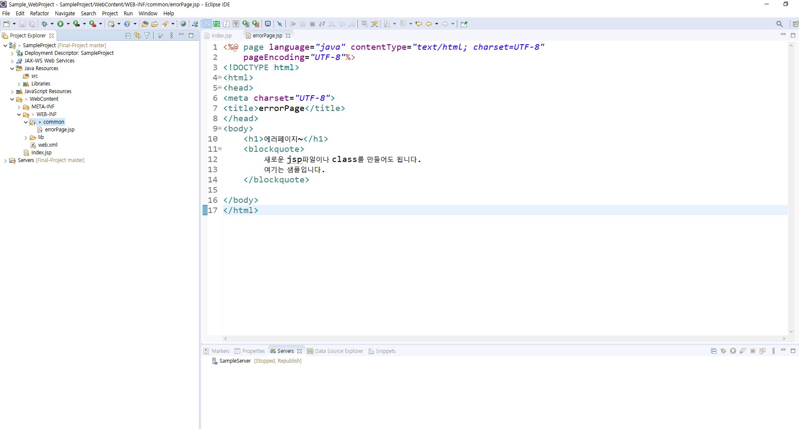

# Github과 이클립스 프로젝트 연결하기

 

# 방법1 - eclipse내에서 프로젝트와 git 연결하여 공동 프로젝트 작업하기.

- eclipse에서 프로젝트를 git과 연결한다.
- 장점: 연결과정이 어렵고, 팀원마다 각각 연결해야된다. 한번 연결하면 동시작업이 용이.
- 이 방법으로 시도하다가 ~내 필기자료 다 날라갔다...ㅠ.ㅠ~

- #### 참고자료
  - [eclipse프로젝트를 github에 연동해서 형상관리하기-준스파파](https://junspapa-itdev.tistory.com/46)

  - [Java프로젝트에 Github에 쉽게 연동하기(with Eclipse)- 프로삽질러 개발로그](https://d-e-v.tistory.com/3)

- #### **주의사항**
  - 팀에서 eclipse연결해서 프로젝트 작업하는 경우는 유료이다.
    - 현재 소속팀: KHAcademyProject2020의 Final-Project

  - 개인 github의 repository를 새로 생성하여 연결해야한다.

  - 저는 `프로삽질러 개발로그`를 참고했습니다.

> ## 1. 방법2부터 작성후에 시도해보겠습니다 ^_^

  

# 방법2 - githubDesktop을 이용하여 프로젝트와 연결하여 공동 프로젝트 작업하기.

- loveAlakazam(최은강)이 제안한 방법
- 장점: githubDesktop만 있다면, 연결과정이 쉽다. 그러나 인코딩 표현이 달라지면 깨질 가능성이 높다.

> ## (1) Github Desktop 설치하기

## 1. [Github desktop 설치 페이지](https://desktop.github.com/)

## 2. **`Download for Windows(64bit)`** 버튼 클릭

- ### :point_down: github desktop 화면
- 단, **github계정으로 로그인해야합니다!**

  

## 3. Final-Project Repository 연결하기.

- ### (1) 상단메뉴 **`File`**  클릭
- ### (2) **`Clone Repository`** 클릭

 

> ### (3) `Final-Project` 프로젝트 클론하여 **로컬저장소** 만들기

  

 

- ### `로컬 저장소` 위치는 사진에서 보이는 것과 같이 **`내문서/Github`** 으로 해주세요.

- ### **즉, `Local path`를 변경하지 말고, 그대로 두세요.**

 

- **로컬 저장소** 와 **원격 저장소**
  - **로컬 저장소**: 개인 컴퓨터(로컬)에서 코드 저장소를 의미합니다.
  - **원격 저장소**: 깃헙 웹사이트 코드 저장소를 의미합니다. 즉 로컬저장소에서 코드를 push하면 원격저장소에 저장이 됩니다.

  

## 4. 샘플 프로젝트(`Sample_WebProject`) 불러오기

> ### (1) 연결 후, 로컬저장소 확인하기.
  - 제 로컬 저장소 위치는 **`내문서/Github/Final-Project`** 입니다.

 

> ### (2) eclipse를 켜서 `Sample_WebProject`를 엽니다.

 

- 샘플 프로젝트 위치(**`로컬저장소 위치`**)는 **`내문서/Github/Final-Project/Sample_WebProject`** 입니다.
  - 샘플은 연동방법을 숙지하기 위해서 만들어놓은 임시 프로젝트입니다!

 

- Final 프로젝트 최종코드는 `내문서/Github/Final-Project/Trip2reap_TeamCode` 입니다.

  

> ### (3) eclipse 인코딩 설정하기

- #### `Window` 상단 탭 메뉴 > `Preferences`

- #### 검색란에 `encoding` 입력후, **Encoding을 `ISO 10646/Unicode(UTF-8)`로 설정**

- #### General > Workspace
  - `Apply` 버튼 클릭

 

- #### Web > CSS Files
  - `Apply` 버튼 클릭

 

- #### Web > HTML Files
  - `Apply` 버튼 클릭

 

- #### Web > JSP Files
  - `Apply and Close` 버튼 클릭

  

## 5. Github Pushing하기

- index.jsp 파일에 코드를 추가 및 수정 하거나
- 새로운 파일을 만들어보세요.
- 그 다음에 Github Desktop에서 commit을 눌러주세요.

 

 

- errorPage.jsp를 추가했습니다.
- 수정되거나 새로운 파일이 추가되면, `Package Explorer`을 보면 파일이나 프로젝트에 **`?`** 표시가 뜹니다.
- 즉, 파일 수정과 추가가 일어났으며, 변경사항이 생겼으므로 *커밋을 해야한다*는 걸 의미해요.

 

- Github Desktop 변동내용

 

- #### 먼저 다른 사람이 공동작업을 할 수 있으니, **`Fetch Origin`** 버튼을 눌러서 **pull**합시다.

 

- ####  **`Fetch Origin`** 버튼을 눌렀음에도 **`pull`** 이 없으면, **push**를 해도 됩니다.

- #### commit버튼을 누르면 **`push`** 버튼을 누르라고 떠요.

 

**push**란?

- **업로드**를 의미합니다.
- 로컬컴퓨터에서 작성한 코드를 [원격저장소](https://github.com/KHAcademyProject2020/Final-Project)에 올립니다.
- 즉, **원격 저장소**는 모든 코드작성자들의 최종산물이라고 보면됩니다.
  - 김기쁨, 김수진, 이수진, 이규호, 최은강 5명이 올린 전체코드가 [원격저장소](https://github.com/KHAcademyProject2020/Final-Project)에 있습니다.

## 6. 다른사람 코드를 Pull 받기

- `Fetch Origin` 클릭

- `pull`이 존재하면, 버튼 클릭!

- **`pull`** 은 **다운로드**를 의미합니다.

## 7. Merge

- 여러사람이 공동작업을 할 때, **코드를 합치는 것** 을 의미합니다.
- 주의사항은 *pull을 안한 상태에서, 동시에 작업한 코드를 push하면 충돌이 일어납니다!*

  
