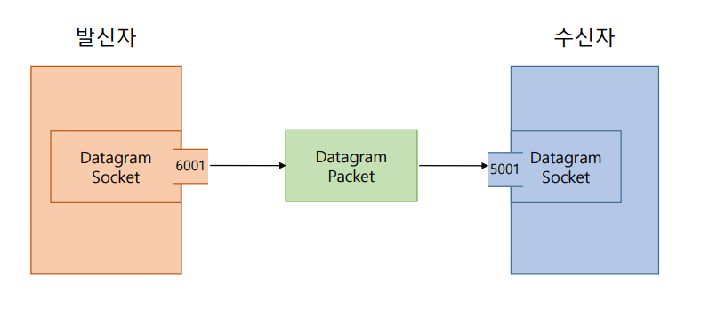
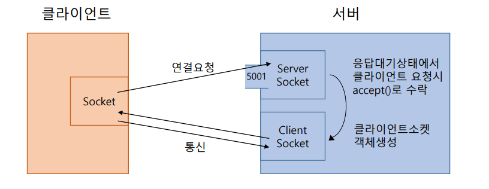

# 네트워크

- 서버와 클라이언트
  - 서버
    - 서버를 제공하는 프로그램
    - 클라이언트의 연결을 수락
    - 클라이언트의 요청내용르 처리 후 응답을 보내는 역할

  - 클라이언트
    - 서비스를 받는 프로그램
    - 네트워크 데이터를 필요로 하는 모든 어플리케이션이 해당

  - IP주소
    - 네트워크 상에서 <STRONG>컴퓨터를 식별(구분)</STRONG>하는 번호

  - 포트
    - 같은 컴퓨터 안에서 <STRONG>프로그램을 식별(구분)</STRONG>하는 번호
    - 클라이언트는 서버 연결 요청시 IP주소와 포트번호를 알아야함.
      - 내가 어떤 IP를 필요로하고
      - 어떤 서비스를 포트번호를 사용할지.

<hr>

# InetAddress 클래스

- IP주소를 다루기 위해 자바에서 제공하는 클래스

- InetAddress 실습하기

  - InetExample.java

    ```java
      package com.kh.example.chap01_inet;

      import java.net.InetAddress;
      import java.net.UnknownHostException;

      public class InetExample {
      	//InetAddress: IP주소를 담기위한 클래스
      	public static void main(String [] args) {
      		// package: java.net
      		// class=> InetAddress
      		// getLocalHost() in java docs
      		// public static InetAddress getLocalHost() throws UnknownHostException
      		try {
      			// getLocalHost(): 로컬 호스트의 정보를 받아온다
      			InetAddress localIp=InetAddress.getLocalHost();

      			// getHostName() : 내컴퓨터 이름
      			System.out.println("내 PC명   : "+ localIp.getHostName());

      			// getHostAddress(): 호스트 IP주소 (IPv4 주소)
      			System.out.println("내 IP주소: "+ localIp.getHostAddress());

      			System.out.println();

      			// getByName(String host)
      			// : domain명을 통해 정보를 얻음.
      			InetAddress iei=InetAddress.getByName("www.iei.or.kr"); // ip주소 1개
      			System.out.println("iei 서버 이름: "+iei.getHostName());
      			System.out.println("iei 서버 IP: "+ iei.getHostAddress());

      			System.out.println();

      			// getAllByName
      			//public static InetAddress[] getAllByName(String host) throws UnknownHostException
      			InetAddress [] naver=InetAddress.getAllByName("www.naver.com");
            //ip주소를 여러개를 받고, 각 ip들은
            // InetAddress 객체 배열형태로 반환받음.

            System.out.println("naver IP개수(서버 호스트개수): "+ naver.length); //2개

      			for(InetAddress addr : naver) {
      				System.out.println("이름: "+addr.getHostName());
      				System.out.println("IP주소: "+addr.getHostAddress()+"\n");
      			}

      		} catch (UnknownHostException e) {
      			e.printStackTrace();
      		}
      	}
      }

    ```

<hr>

# 소켓 프로그래밍
> - 소켓을 이용한 통신프로그래밍
> - 소켓(Socket) : 프로세스 간의 통신에 사용되는 양쪽 끝단
> - TCP
  - 데이터 전송속도가 느림.
  - 정확하고 안정적으로 전달할 수 있는 연결
  - 연결 지향적 프로토콜
    - 연결이 제대로 됐는지 확인과정이 있음.
    - 3 Hand shakes
    - 신뢰적인 연결
> - UDP
  - 데이터 전송속도가 빠르다.
  - 안정적으로 신뢰적으로 연결을 하지 않는다.
    - 중간 확인 없고 보내기만 함.
    - 연결이 되었는지 확인을 안한다.
  - 비연결 지향 프로토콜
  - 실시간 돌아야할 때, 빠르게 처리해야하는 것
    - 게임
    - 실시간 채팅

- UDP 소켓 프로그래밍
  - UDP는 연결지향적이지 않기 때문에 연결요청을 받아줄 소켓이 없다.
  - 서버소켓이 필요 없다.
  - 패킷 단위(DatagramPacket)으로 데이터를 주고받는다.

    

<hr>

# TCP 소켓 통신프로그래밍

> - 서버가 열려야한다.(먼저 실행)
> - 클라이언트의 요청을 기다린다.
> - <strong>서버용 프로그램과 클라이언트용 프로그램을 따로 구현</strong>
> - 자바에서는 TCP 소켓프로그래밍을 위해 java.net패키지의 ServerSocket과 Socket클래스 제공

> - 연결과정
  

 > - 서버용 TCP 소켓 프로그래밍 순서
  - 서버의 포트번호 정함
  - 서버용 소켓 객체 생성
  - 클라이언트 쪽에서 접속 요청이 오기를 기다림.
  - 접속 요청이 오면 요청수락(메소드 accept())후에 해당 클라이언트에 대한 소켓 객체 생성
  - 연결된 클라이언트와 입출력 스트림 생성
  - 보조 스트림을 통해 성능 개선
  - 스트림을 통해 읽고 쓰기
  - 통신종료

  > - 클라이언트용 TCP 소켓 프로그래밍 순서
    - 서버의 IP주소와 서버가 정한 포트번호를 매개변수로 하여 클라이언트용 소켓 객체 생성
    - 서버와의 입출력 스트림 오픈
    - 보조 스트림을 통해 성능 개선
    - 스트림을 통해 읽고 쓰기
    - 통신 종료


# TCP 서버 실습
- Server.java
  ```java
    package com.kh.example.chap02_tcp.part1.controller;

    import java.io.BufferedReader;
    import java.io.IOException;
    import java.io.InputStream;
    import java.io.InputStreamReader;
    import java.io.OutputStream;
    import java.io.PrintWriter;
    import java.net.ServerSocket;
    import java.net.Socket;

    // TCP(Transmission Control Protocol)
    // 서버와 클라이언트 간의 1:1 소켓 통신(연결지향적 프로토콜)
    // 데이터 전송 전 먼저 서버와  클라이언트가 연결되어야 함
    // => 서버가 먼저 실행되어 클라이언트의 요청을 기다림
    // => 서버, 클라이언트용 프로그램을 따로 구현 해야함.

    // 데이터 전송 순서가 보장되고
    // 수신여부를 판단하여 손실시 재전송
    // UDP보다 속도는 느림

    // ServerSocket
    // 	=> 포트와 연결되어 외부의 요청을 기다리다가
    //  => 요청이 들어오면 Socket을 생성한다.
    //	=> 소켓과 소켓 간 통신이 이뤄진다.

    // Socket = ClientSocket
    // 	=> 프로세스 간 통신 담당
    //	=> InputStream/OutputStream 보유
    //	  > 이 스트림을 통해 프로세스간의 통신(입출력)이 이뤄짐.

    public class Server {
    	public void serverStart() {
    		//서버용 TCP 소켓 프로그래밍 순서
    		//1. 서버의 포트번호를 정한다.
    		int port=8500;
    		// 0<= port <= 65535 까지 지정가능
    		// ~1023 이하의 포트번호는 이미 존재하고 있다.
    		// 그 이상을 사용해라.


    		try {
    			//2. 서버의 소켓 객체를 생성한다.
    			// ServerSocket 객체를 생성하여 포트와 결합
    			ServerSocket server= new ServerSocket(port);

    			//3. 클라이언트쪽에서 접속요청이 오기를 기다린다.
    			System.out.println("....Waiting for Clients Request....");

    			//4. 접속 요청이 오면 요청을 수락한다. accept()
    			//	 해당 클라이언트에 대한 소켓 객체 생성
    			Socket clientSocket= server.accept();
    			//server.accept()의 반환값이 요청한 클라이언트 소켓 객체를 반환시킨다.

    			//클라이언트의 IP주소에서 호스트 주소를 갖고온다.
    			String clientIP= clientSocket.getInetAddress().getHostAddress();
    			System.out.println(clientIP+ "연결 요청");

    			//5. 연결된 클라이언트와 입출력 스트림 생성
    			//클라이언트는 입출력 스트림을 갖고있음.
    			// InputStream/ OutputStream => byte단위로 데이터 입출력(전달)
    			InputStream inputStream= clientSocket.getInputStream();
    			OutputStream outputStream= clientSocket.getOutputStream();

    			//6. 보조 스트림 통해 성능 개선
    			// 문자를 보내기
    			// InputStream/ OutputStream은 바이트 기반의 스트림이라서
    			// 문자로 보내기가 힘들다.

    			//입력스트림 개선.
    			// 문자 스트림으로 변환해야한다. (InputStreamReader 를 이용.)
    			InputStreamReader isr=new InputStreamReader(inputStream);// 보조스트림.
    			BufferedReader br= new BufferedReader(isr); //버퍼단위로 문자를 읽어온다.

    			//출력스트림 개선.
    			PrintWriter pw= new PrintWriter(outputStream);//보조스트림


    			//7. 스트림을 통해 읽고 쓰기
    			// 연결이 성공되면
    			// 서버가 클라이언트에게 "만나서 반갑습니다." 라는 문자열을 출력.
    			// 클라이언트 실행 콘솔창에 출력된다.
    			pw.println("만나서 반갑습니다."); //서버출력
    			pw.flush(); //버퍼를 비운다.

    			String message=br.readLine();

    			// ClientIP가 서버에게 보내는 메시지 출력.
    			// 클라이언트가 보낸 메시지를 서버실행 콘솔창에 출력
    			System.out.println(clientIP+"가 보낸 메시지: "+ message);

    			//8. 통신 종료.
    			pw.close();
    			br.close();
    			outputStream.close();
    			inputStream.close();
    			server.close();

    		} catch (IOException e) {
    			e.printStackTrace();
    		}
    	}

    }

  ```

- ServerRun.java
  ```java
  package com.kh.example.chap02_tcp.part1.run;

  import com.kh.example.chap02_tcp.part1.controller.Server;

  public class ServerRun {
  	public static void main(String []args) {
  		new Server().serverStart();
  	}
  }

  ```


# TCP 클라이언트 실습

- Client.java
  ```java
    package com.kh.example.chap02_tcp.part1.controller;

    import java.io.BufferedReader;
    import java.io.IOException;
    import java.io.InputStreamReader;
    import java.io.PrintWriter;
    import java.net.InetAddress;
    import java.net.Socket;
    import java.net.UnknownHostException;

    // 클라이언트용 TCP 소켓 프로그래밍 순서.
    // 1. 서버 IP주소와 서버가 정한 포트번호를 매개변수에 전달하여
    //		클라이언트용 소켓 객체를 생성한다.
    // 2. 서버와의 입출력 스트림 오픈한다.
    // 3. 보조스트림을 통해 성능을 개선한다.
    // 4. 스트림을 통해 읽고 쓴다.
    // 5. 통신종료.


    public class Client {
    	public void startClient() {

    		int port=8500;

    		//현재 컴퓨터의 로컬 주소=> ip주소 얻는다.
    		try {

    			// 1.서버IP주소와 서버가 정한 포트번호를 매개변수로 전달하여
    			// 클라이언트용 소켓을 생성한다.
    			// 서버의 IP와 포트번호를 알아놓는다.
    			//진짜 서버의 IP주소를 갖고와야한다.
    			//host주소를 갖고오려면 InetAddress로부터 갖고온다.

    			//getLocalHost() => 내컴퓨터의 정보를 갖고온다.
    			//getHostAddress()=> 내컴퓨터의 정보중 IP주소 정보를 갖고온다.
    			String serverIP= InetAddress.getLocalHost().getHostAddress();

    			// 두개 프로그램 ip는 같을 수 있다 (내컴퓨터에서 돌리니까)
    			// 내꺼컴퓨터 <---> 상대방컴퓨터
    			// 상대방컴퓨터의 주소와 포트번호를 갖고 있어야한다. (중요)
    			// InetAddress.getHostName();
    			// Socket(InetAddress address, int port)
    			Socket socket= new Socket(serverIP, port);

    			//서버와 연결이 성공한 경우에만 스트림을 오픈한다.
    			if(socket!=null) {
    				// 2. 서버와의 입출력 스트림 오픈한다.
    				// 3. 보조스트림을 통해 성능을 개선한다.
    				BufferedReader br= new BufferedReader(new InputStreamReader(socket.getInputStream()));
    				PrintWriter pw= new PrintWriter(socket.getOutputStream());

    				// 4. 스트림을 통해 읽고 쓴다.
    				// 클라이언트가 서버에게 "저는 클라이언트입니다. 반가워요~"라는 메시지를 전송
    				// 서버의 실행콘솔창에서  clientIP가 보내는 메시지에 해당한다
    				pw.println("저는 클라이언트입니다. 반가워요~");

    				//서버가 보낸 메시지를 읽는다.
    				//=> "만나서 반갑습니다."를 읽어와서 클라이언트 콘솔창에 출력.
    				System.out.println(br.readLine());
    				pw.flush();

    				// 5. 통신종료.
    				br.close();
    				pw.close();
    				socket.close();
    			}
    		} catch (UnknownHostException e) {
    			e.printStackTrace();
    		} catch (IOException e) {
    			e.printStackTrace();
    		}
    	}
    }
  ```

- ClientRun.java
  ```java
  package com.kh.example.chap02_tcp.part1.run;

  import com.kh.example.chap02_tcp.part1.controller.Client;

  public class ClientRun {
  	public static void main(String [] args) {
  		new Client().startClient();
  	}
  }
  ```

# TCP 통신 실습 2
- Server.java
  ```java
  package com.kh.example.chap02_tcp.part2.controller;

  import java.io.BufferedReader;
  import java.io.IOException;
  import java.io.InputStreamReader;
  import java.io.PrintWriter;
  import java.net.ServerSocket;
  import java.net.Socket;

  public class Server {
  	public void startServer() {
  		//1. 포트번호지정
  		int port= 8500;

  		//2. 서버 소켓 객체생성
  		try {
  			ServerSocket server= new ServerSocket(port);

  			//3. 클라이언트 쪽에서 접속이 오기를 기다린다.
  			System.out.println("클라이언트 요청을 기다리고 있습니다.");

  			//4. 접속요청을 수락하고 클라이언트에 대한 소켓 객체생성
  			Socket client=server.accept();
  			String clientIP= client.getInetAddress().getHostAddress();
  			System.out.println(clientIP+"가 연결을 요청합니다..!");

  			// client에는 입출력스트림이 동반되어있다.
  			//5. 입출력스트림을 (기반스트림) 생성한다.
  			//6. 보조스트림을 통해 기반스트림의 성능을 개선
  			BufferedReader br= new BufferedReader(new InputStreamReader(client.getInputStream()));
  			PrintWriter pw =new PrintWriter(client.getOutputStream());

  			//7. 스트림을 통해 읽고쓰기  출력한다.
  			while(true) {
  				String message= br.readLine(); //클라이언트로부 메시지를 받는다.
  				if(message.equals("exit")){
  					System.out.println("서버 접속을 종료합니다.");
  					break;
  				}

  				System.out.println(clientIP+"가 보낸 메시지: "+ message);
  				pw.println("메시지 전송 성공하였습니다.");
  				pw.flush();
  			}

  			//통신종료
  			System.out.println("통신을  종료합니다.");
  			server.close();
  			br.close();
  			pw.close();

  		} catch (IOException e) {
  			e.printStackTrace();
  		}
  	}
  }
  ```

<br>

- ServerRun.java
  ```java
  package com.kh.example.chap02_tcp.part2.run;
  import com.kh.example.chap02_tcp.part2.controller.Server;

  public class ServerRun {
  	public static void main(String [] args) {
  		new Server().startServer();
  	}
  }
  ```

- Client.java
  ```java
  package com.kh.example.chap02_tcp.part2.controller;

  import java.io.BufferedReader;
  import java.io.IOException;
  import java.io.InputStreamReader;
  import java.io.PrintWriter;
  import java.net.InetAddress;
  import java.net.Socket;
  import java.net.UnknownHostException;
  import java.util.Scanner;

  public class Client {
  	//서버의 IP주소와 포트번호를 알아낸다.
  	public void startClient() {
  		int port=8500;
  		try {
  			String serverIP=InetAddress.getLocalHost().getHostAddress();

  			//1.클라이언트 소켓 객체만들기
  			Socket socket= new Socket(serverIP, port);

  			//2. 서버접근 요청을 보낸다.
  			if(socket!=null) {
  				//3. 서버의 입출력 스트림 오픈
  				//4. 보조스트림으로 기능 개선
  				BufferedReader br= new BufferedReader(new InputStreamReader(socket.getInputStream()));
  				PrintWriter pw =new PrintWriter(socket.getOutputStream());

  				Scanner sc= new Scanner(System.in);
  				do {
  					//안내 문구
  					System.out.print("대화입력: ");
  					String message= sc.nextLine();

  					//5. 스트링을 통해 읽고 쓰기
  					pw.println(message);
  					pw.flush();
  					//exit입력시 종료.
  					if(message.equals("exit"))
  						break; //do-while문을 빠져나감.

  					//서버로부터의 메시지를 읽어온다.
  					String serverMsg= br.readLine();
  					System.out.println("server: "+serverMsg);

  				}while(true);

  				//통신종료
  				br.close();
  				pw.close();
  				socket.close();
  				sc.close();
  			}
  		} catch (UnknownHostException e) {
  			e.printStackTrace();
  		} catch (IOException e) {
  			e.printStackTrace();
  		}
  	}
  }
  ```

<br>

- ClientRun.java
  ```java
  package com.kh.example.chap02_tcp.part2.run;
  import com.kh.example.chap02_tcp.part2.controller.Client;

  public class ClientRun {
  	public static void main(String [] args) {
  		new Client().startClient();
  	}
  }
  ```
- 결과

