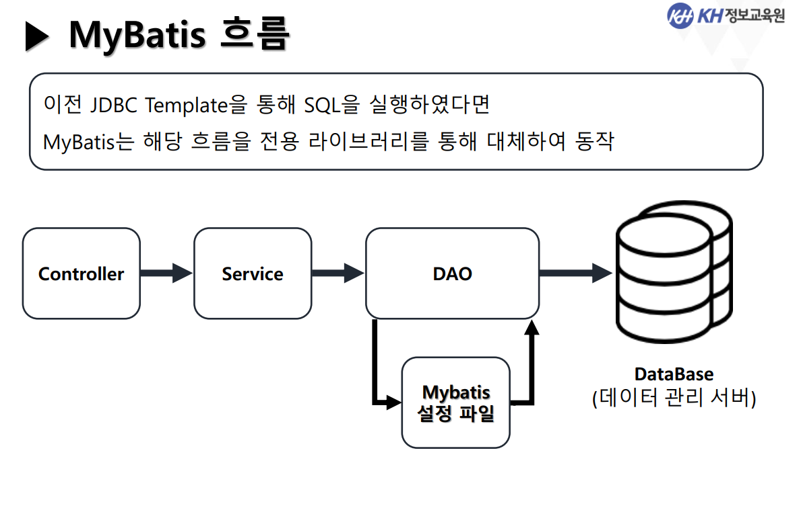
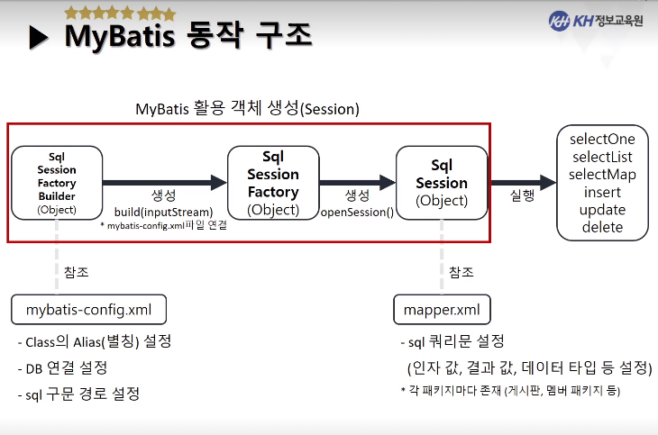

# MyBatis 수업 내용 정리노트


<details>

<summary>프레임워크개념과 MyBatis</summary>

- Framework [:link:](#Framework)
- MyBatis [:link:](#MyBatis)

</details>

> # Framework

### 1. 프레임워크란?

```
개발자가 소프트웨어를 개발함에 있어서

- 코드를 구현하는 개발시간을 줄이고

- 코드의 재사용성을 증가시키기 위한

일련의 "클래스 묶음", "뼈대", "틀"을 제공하는 라이브러리를 구현해놓은 것을 의미한다.

```

### 프레임워크의 특징

- 개발자가 따라야 하는 가이드를 제공한다.
- 개발할 수 있는 범위가 정해져있다.
- 개발자를 위한 다양한 도구 및 플러그인을 지원한다.


- 장점
  - **개발시간을 줄일 수 있다.**
  - 정형화되어있어 일정 수준 이상의 품질을 기대할 수 있다.
  - **유지보수가 쉽다.**

- 단점
  - 지나친 의존 시 개발자들의 능력이 떨어져서 스스로 개발하는 것이 어려워짐.
  - 습득시간이 오래걸림.


<hr>

<br><br>

# 프로젝트 세팅하기

- [프로젝트 세팅](./MyBatis_프로젝트세팅.md)

<br><br>

> # 정리

#### **`web.xml`** 의 역할: 웹애플리케이션(Web App) 전체 설정 정보를 갖고 있다.


#### **`mybatis-config.xml`**: mybatis에 관한 전체 설정 정보를 갖고 있다.


#### **`mapper.xml`** : 쿼리문에 대한 정보를 갖고 있다.

- **`mapper.xml`** 은 이전 배운 내용 중 sql쿼리문을 저장한 `*.properties`과 동일한 역할을 한다.
  - [예시. SEMI프로젝트의 member와 관련된 sql을 저장한 프로퍼티 파일 - member-query.properties ](https://github.com/KHAcademyProject2020/Semi-Project/blob/master/04_FinalCodes/PROJECT_Codes/SEMI_GoodBall_CEK_ver02/src/sql/member/member-query.properties)


<br>

> # MyBatis

- **Mapper 설정 파일을 통해서 JDBC를 구현한 영속성 프레임워크**

- 데이터의 입력/조회/수정/삭제 (CRUD)를 보다 편하게 하기위해 `XML`로 구조화했다.

- 기존 JDBC를 통해 구현했던 상당 부분의 코드와 파라미터 설정 및 결과 매핑을 XML설정을 통해 쉽게 구현.


> # MyBatis 흐름

- (MyBatis 이전) JDBC_Template을 통해서 SQL을 실행
  - [예시. SEMI프로젝트 jdbc 템플릿코드](https://github.com/KHAcademyProject2020/Semi-Project/blob/master/04_FinalCodes/PROJECT_Codes/SEMI_GoodBall_CEK_ver02/src/common/JDBCTemplate.java)
  - JDBC_Template.java의 역할.
    - **connection객체를 만들어서 DB와 연결**
    - **트랜젝션 처리**
      - commit
      - rollback

    - **close()메소드 오버로딩**
      -PrepareStatment 종료
      -ResultSet 종료
      -Connection 종료


- (MyBatis) 해당 흐름을 전용 라이브러리를 통해 대체하여 동작.



<br>

> # **MyBatis 동작 구조**




1. **`SqlSessionFactoryBuilder`** 객체는 `build()`메소드를 통해서 **`SqlSessionFactory`** 객체를 만든다.

- build() 메소드에는 InputStream 타입의 매개변수가 있는데, 이는 `mybatis-config.xml`를 읽어온다.

- `mybatis-config.xml`은 mybatis에 관한 전체 설정정보를 갖고 있다.
  - 클래스의 별칭 설정
  - 데이터베이스 연결 설정
  - sql구문 경로 설정

<br>

2. **`SqlSessionFactory`** 객체는 `openSession()`메소드를 통해서 **`SqlSession`** 객체를 만든다.

<br>

3. **`SqlSession`** 객체는 `mapper.xml`을 참조하고 있다.


<br>

4. 반환값이 무엇이냐에 따라서 메소드를 선택할 수 있다.

- `selectOne()`
- `selectList()`
- `selectMap()`
- `insert()`
- `update()`
- `delete()`

<br><br>

# [MyBatis실습](MyBatis)

<br>

# MyBatis

- sqlSession을 이용하여 DAO와 연결하고 쿼리와 관련된 메소드를 호출한다.

- SqlSessionFactory객체는 SqlSessionFactoryBuilder 객체로부터 build(InputStream) 메소드를 통해서 생성된다.
  - 이 때 읽어오는 InputStream은 mybatis에관한 전체 설정정보를 가진 `mybatis-config.xml`이다.

- SqlSession객체는  SqlSessionFactory객체로부터 openSession()메소드를 통해서 만들어진다.

- JDBC와 다르게, mybatis에서는 트랜젝션처리와 close()처리를 안해도된다.
  - mybatis는 sqlSession이 지원한다.

<BR><BR><BR>

<hr>

<br>

# mybatis-config.xml

> ## `<transactionManager>`

- 트랜젝션을 어떻게 제어 (commit/ rollback)

- 트랜젝션을 누가 관리할 것인가?

|종류|정의|
|:--:|:--:|
|JDBC|수동으로 트랜젝션을 처리<BR>직접 처리<BR>수동 COMMIT|
|MANAGED|자동으로 트랜젝션을 처리<BR>트랜젝션에 대해 어떠한 직접적인 영향을 행사하지 않음.<BR>자동 COMMIT<BR>컨테이너가 모든 트랜젝션의 생명주기를 관리한다.|

- 컨테이너가 관리: 서블릿 직접 관리.

<br>

> ## `<dataSource>`

- 실제 DB 접속에 관한 정보들을 넣는 태그.
- type이 ConnectionPool을 사용여부에 따라서 다르다.

|종류|정의|
|:--:|:--:|
|POOLED|- Connection객체를 새로 만들지 않고(미리 만들어놓고) 사용.<br>- 객체를 만드는데 걸리는 시간이 줄어든다.<br>- 사용자의 요청이 있을 때 DB에 연결하여 명령을 실행하고 명령이 종료되어도 연결이 종료되지 않고 POOL에 저장하여 요청이 올 때 꺼내서 재사용한다.<BR>- Web Application에서 흔하게 많이 사용되는 방법이다.|
|UNPOOLED|- 그때그때마다 Connection객체를 새로 만드는 것.<br>- DB요청이 올때마다 실시간으로 커넥션 객체를 만들고 닫는다.<BR>- 미리 객체를 만들어놓는 방식이 아니므로, 느리다.|
|JNDI|수업과 관련이 조금 멀으므로 생략.|
