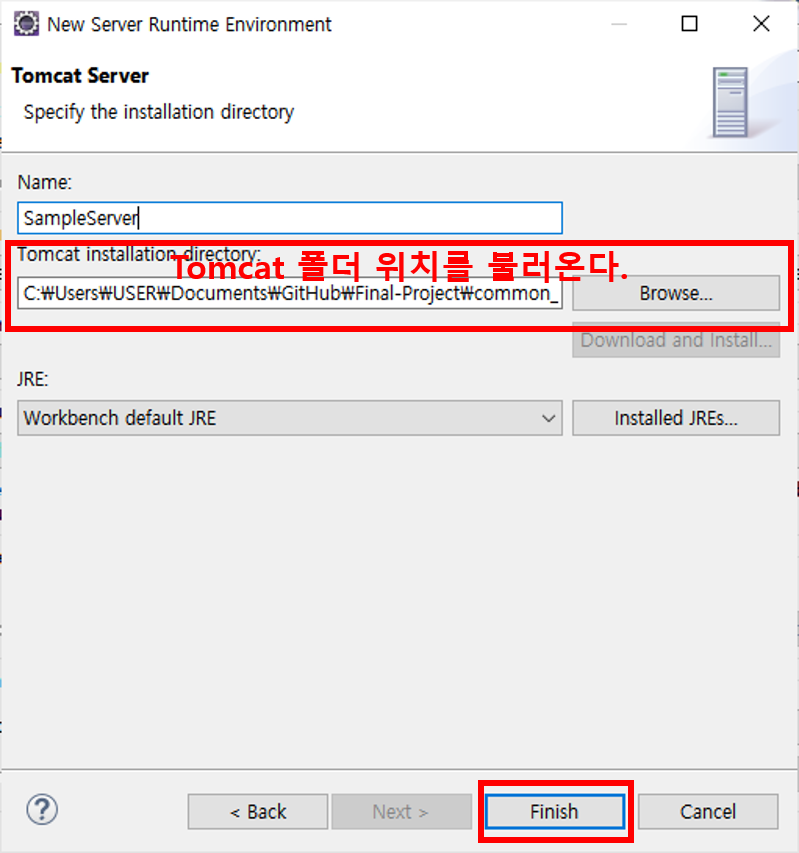
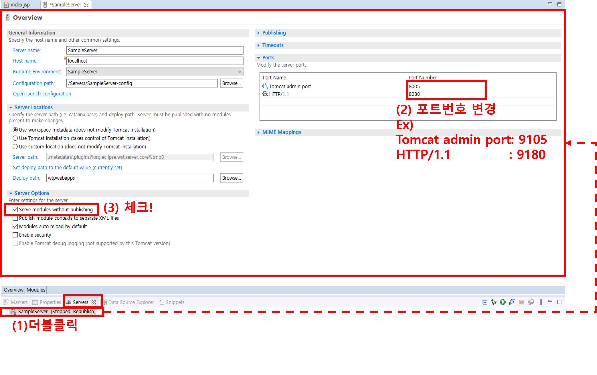
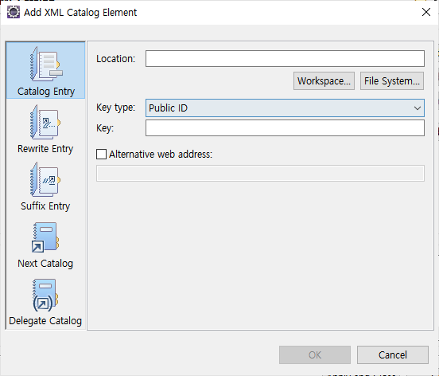
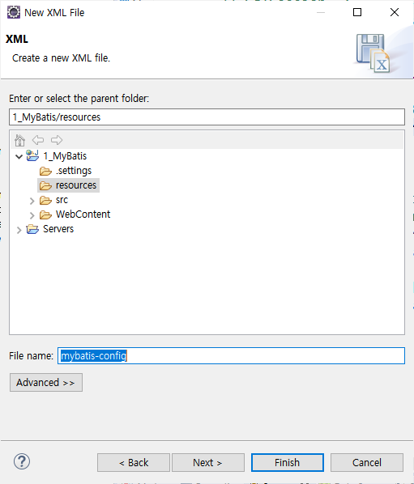
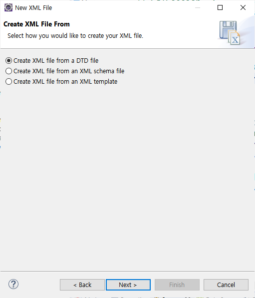
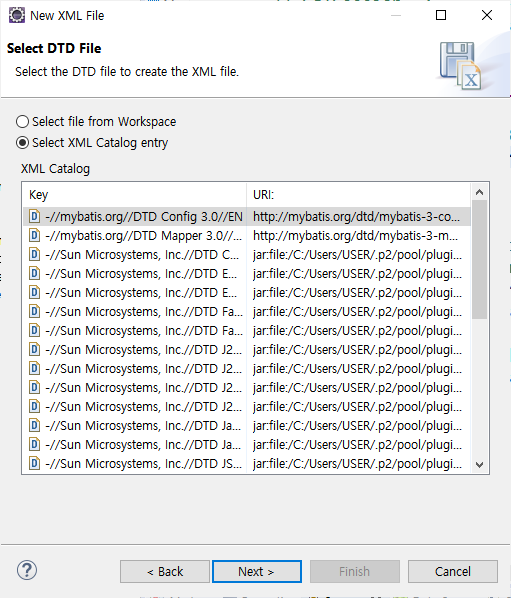

# :computer: Dynamic Web Project 만들기

<details>

<summary>요약</summary>

- 0. MyBatis 설치하기 [:baby_chick:](#Mybatis-설치하기)
- 1. 프로젝트 만들기 [:baby_chick:](#프로젝트-만들기)
- 2. 서버 연결하기 [:baby_chick:](#서버-연결하기)
- 3. jar파일 연결 [:baby_chick:](#jar파일-연결)

</details>

<br>

> ## MyBatis 설치하기

- [mybatis3.5.6 다운로드 페이지](https://github.com/mybatis/mybatis-3/releases)

- `mybatis-3.5.6 zip 링크` 클릭

- ibatis vs mybatis
  - mybatis는 기존 ibatis의 한계점인 동적쿼리와 annotation처리를 보강함.
  - ibatis는 현재 비활성화 상태이며, 참고만 가능.


<br><br>

> ## Dynamic Web Project 자바프로젝트 만들기

- #### (1) 오른쪽 마우스 클릭
- #### (2) New
- #### (3) Dynamic Web Project

<br>


> #### (1) 프로젝트 이름 작성
> #### (2) Target Run Time 에서 `**New Run Time**` 클릭

> #### (3) 톰캣 서버 버젼 선택: **`Apache Tomcat v9.0`**
> #### (4) Next

<BR><br>



> #### (2-3) 톰캣 서버 이름 작성
> #### (2-4) 톰캣 서버 위치 - `apache-tomcat-9.x 디렉토리 경로`를 찾으면 된다.
> #### (2-5) Finish 버튼 클릭

<br><br>


> #### (3) Next 버튼 클릭

<br><br>


> #### (1) Default output folder 경로 수정: **`WebContent/WEB-INF/classes`**
> #### (2) Next 버튼 클릭

<br><br>


> #### (1) Generate web.xml deployment descriptor 체크 박스 체크
> #### (2) Finish 버튼 클릭

<br><br>

> ## 서버 연결하기

> #### (1) 하단 **`Servers`** 탭 클릭
> #### (2) 만일 서버가 존재하지 않는다면 **`No servers are available Click this link to create a new server`** 링크 클릭

> #### (3) 서버이름(Server name) 작성.
    - Server's host name: localhost로 일단 둔다.

> #### (4) Finish 버튼 클릭

<br><br>



> #### (5-1) 만든 서버 다시클릭
> #### (5-2) Port번호 변경 - 8080은 이미 사용되고 있음. 다른 포트번호와 충돌되지 않게 한다.
> #### (5-3) `Serve modules without publishing` 체크박스 체크표시!
> #### (5-4) 서버 저장하기( 단축키: `ctrl`+`s` )

<br><br>

> ## jar파일 연결

- #### **`ojdbc6.jar`** 파일은 **`WebContent/WEB-INF/lib`** 에 넣는다.
- #### 그동안 사용한 jar 파일들
    - jdbc관련: `ojdbc6.jar`
    - cos 관련: `cos.jar`
    - json관련: `json-simple-1.1.1.jar`
    - gson관련: `gson-2.8.5.jar`
    - mybatis관련: `mybatis-3.5.5.jar`
    - jstl 관련
        - `taglibs-standard-compat-1.2.5.jar`
        - `taglibs-standard-impl-1.2.5.jar`
        - `taglibs-standard-jstlel-1.2.5.jar`
        - `taglibs-standard-spec-1.2.5.jar`

<br><br>


> # DTD 등록하여, mybatis-config.xml을 바로 불러오기.

- 목적: configuration 파일의 위치를 기억하기가 어렵다.

```xml
<?xml version="1.0" encoding="UTF-8"?>
<!DOCTYPE configuration PUBLIC "-//mybatis.org//DTD Config 3.0//EN" "http://mybatis.org/dtd/mybatis-3-config.dtd">
<configuration>

</configuration>
```

- 으악 너무 귀찮고, 너무길어!!
- 바로 불러올 수있는 방법이 없을까?

<br><br>


- 매번 쓰지말고, 항상 불러올 수 없을까?


```
1. Window 탭 > Preferences > XML > XML Catalog

2. User Specified Entries 선택

3. Add 버튼 클릭
```


<br><br>




**`Location`** : http://mybatis.org/dtd/mybatis-3-config.dtd

<br>

**`Key`**: -//mybatis.org//DTD Config 3.0//EN

<br><BR>

- xml 파일 만들기(Java Resources/resources패키지에 저장.)



<BR>



<BR>



<BR>


<BR>

```
4. Java Resources > resources 패키지 선택

5. New > other > xml 클릭 > 이름: mybatis-config


6. next 클릭

7. create XML file from a DTD file 클릭

8. next

9. Select XML Catalog entry 선택하고

Key: -//mybatis.org//DTD Config 3.0//EN

URI: http://mybatis.org/dtd/mybatis-3-config.dtd

인 DTD 파일을 선택 후 next

10. 빨간색 밑줄이 없으면 그대로 Finish버튼 클릭
```


<br><br>


> # mybatis-config xml 태그 순서


[:arrow_up:](#)
