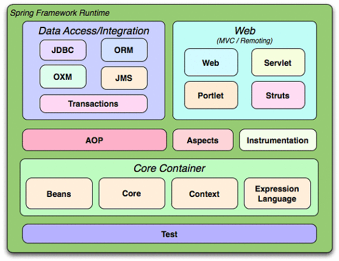
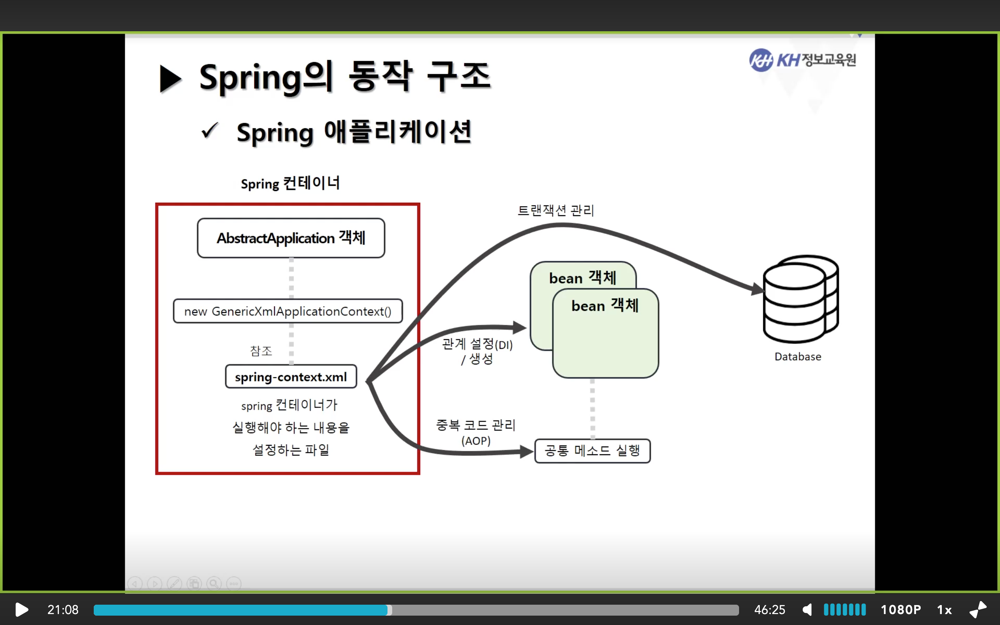

# Spring 복습노트

> ## Apache Maven

- **자바용 프로젝트 관리 도구**
- **pom.xml** (Project Object Model XML)문서를 통해 해당
  - **프로젝트의 버전 정보**들을 관리
  - **라이브러리 정보**들을 관리
  - **라이브러리를 자동으로 프로젝트에 추가**할 때 주로 `pom.xml`을 사용한다.

<br><br>

> ## pom.xml 예시

```xml
<?xml version="1.0" encoding="UTF-8"?>
<project xmlns="http://maven.apache.org/POM/4.0.0" xmlns:xsi="http://www.w3.org/2001/XMLSchema-instance"
	xsi:schemaLocation="http://maven.apache.org/POM/4.0.0 https://maven.apache.org/maven-v4_0_0.xsd">

  <!--모델정보 -->
	<modelVersion>4.0.0</modelVersion>
	<groupId>com.kh</groupId>
	<artifactId>spring</artifactId>
	<name>1_Spring</name>
	<packaging>war</packaging>
	<version>1.0.0-BUILD-SNAPSHOT</version>

  <!--프레임워크 정보-->
	<properties>
		<java-version>1.8</java-version>
		<org.springframework-version>5.2.9.RELEASE</org.springframework-version>
		<org.aspectj-version>1.6.10</org.aspectj-version>
		<org.slf4j-version>1.6.6</org.slf4j-version>
	</properties>

	<!-- 사설저장소를 등록하기. (단, 너무많이 등록하면 느려질 수 있다.) -->
	<repositories>
		<repository>
			<id>Central</id>
			<url>https://repo1.maven.org/maven2/</url>
		</repository>

		<repository>
			<id>Datanucleus</id>
			<url>http://www.datanucleus.org/downloads/maven2/</url>
		</repository>
	</repositories>

	<!--dependencies:  라이브러리 등록 -->
	<dependencies>
		<!-- Spring -->
		<dependency>
			<groupId>org.springframework</groupId>
			<artifactId>spring-context</artifactId>
			<version>${org.springframework-version}</version>
			<exclusions>
				<!-- Exclude Commons Logging in favor of SLF4j -->
				<exclusion>
					<groupId>commons-logging</groupId>
					<artifactId>commons-logging</artifactId>
				 </exclusion>
			</exclusions>
		</dependency>
		<dependency>
			<groupId>org.springframework</groupId>
			<artifactId>spring-webmvc</artifactId>
			<version>${org.springframework-version}</version>
		</dependency>

		<!-- AspectJ -->
		<dependency>
			<groupId>org.aspectj</groupId>
			<artifactId>aspectjrt</artifactId>
			<version>${org.aspectj-version}</version>
		</dependency>

		<!-- Logging -->
		<dependency>
			<groupId>org.slf4j</groupId>
			<artifactId>slf4j-api</artifactId>
			<version>${org.slf4j-version}</version>
		</dependency>
		<dependency>
			<groupId>org.slf4j</groupId>
			<artifactId>jcl-over-slf4j</artifactId>
			<version>${org.slf4j-version}</version>
			<scope>runtime</scope>
		</dependency>
		<dependency>
			<groupId>org.slf4j</groupId>
			<artifactId>slf4j-log4j12</artifactId>
			<version>${org.slf4j-version}</version>
			<scope>runtime</scope>
		</dependency>
		<dependency>
			<groupId>log4j</groupId>
			<artifactId>log4j</artifactId>
			<version>1.2.15</version>
			<exclusions>
				<exclusion>
					<groupId>javax.mail</groupId>
					<artifactId>mail</artifactId>
				</exclusion>
				<exclusion>
					<groupId>javax.jms</groupId>
					<artifactId>jms</artifactId>
				</exclusion>
				<exclusion>
					<groupId>com.sun.jdmk</groupId>
					<artifactId>jmxtools</artifactId>
				</exclusion>
				<exclusion>
					<groupId>com.sun.jmx</groupId>
					<artifactId>jmxri</artifactId>
				</exclusion>
			</exclusions>
			<scope>runtime</scope>
		</dependency>

		<!-- @Inject -->
		<dependency>
			<groupId>javax.inject</groupId>
			<artifactId>javax.inject</artifactId>
			<version>1</version>
		</dependency>

		<!-- Servlet -->
		<dependency>
			<groupId>javax.servlet</groupId>
			<artifactId>servlet-api</artifactId>
			<version>2.5</version>
			<scope>provided</scope>
		</dependency>
		<dependency>
			<groupId>javax.servlet.jsp</groupId>
			<artifactId>jsp-api</artifactId>
			<version>2.1</version>
			<scope>provided</scope>
		</dependency>
		<dependency>
			<groupId>javax.servlet</groupId>
			<artifactId>jstl</artifactId>
			<version>1.2</version>
		</dependency>

		<!-- Test -->
		<dependency>
			<groupId>junit</groupId>
			<artifactId>junit</artifactId>
			<version>4.13.1</version>
			<scope>test</scope>
		</dependency>

		<!--[OJDBC6] -->
		<!-- https://mvnrepository.com/artifact/com.oracle.database.jdbc/ojdbc6 -->
		<dependency>
		    <groupId>com.oracle.database.jdbc</groupId>
		    <artifactId>ojdbc6</artifactId>
		    <version>11.2.0.4</version>
		</dependency>

		<!-- https://mvnrepository.com/artifact/oracle/ojdbc6 -->
		<dependency>
		    <groupId>oracle</groupId>
		    <artifactId>ojdbc6</artifactId>
		    <version>11.2.0.3</version>
		</dependency>


		<!-- mybatis -->
		<!-- https://mvnrepository.com/artifact/org.mybatis/mybatis -->
		<dependency>
		    <groupId>org.mybatis</groupId>
		    <artifactId>mybatis</artifactId>
		    <version>3.5.3</version>
		</dependency>

		<!--Spring Mybatis
			Spring에서 Mybatis를 사용하기위한 라이브러리 -->
		<!-- Spring과 dependency들을 연결해놓는 라이브러리 -->
		<!-- https://mvnrepository.com/artifact/org.mybatis/mybatis-spring -->
		<dependency>
		    <groupId>org.mybatis</groupId>
		    <artifactId>mybatis-spring</artifactId>
		    <version>1.3.2</version>
		</dependency>

		<!-- Spring-jdbc: Spring에서 Database를 사용하기 위한 라이브러리 -->
		<!-- https://mvnrepository.com/artifact/org.springframework/spring-jdbc -->
		<dependency>
		    <groupId>org.springframework</groupId>
		    <artifactId>spring-jdbc</artifactId>
		    <version>${org.springframework-version}</version>
		</dependency>

		<!--Connection pool설정을 위한 라이브러리. -->
		<!--  Connection pool/unpool상태 설정. -->
		<!-- https://mvnrepository.com/artifact/commons-dbcp/commons-dbcp -->
		<dependency>
		    <groupId>commons-dbcp</groupId>
		    <artifactId>commons-dbcp</artifactId>
		    <version>1.4</version>
		</dependency>


		<!-- 10.19 -->
		<!-- Adding spring security module(스프링 보안 모듈 추가- bcrypt)
			스프링 5.2.9버젼에서는 동작이 안되기때문에 버젼을 낮춘다.

			암호화에 필요한 것은 security/ web/ core
		-->
		<dependency>
			<groupId>org.springframework.security</groupId>
			<artifactId>spring-security-core</artifactId>
			<version>5.2.7.RELEASE</version>
		</dependency>

		<dependency>
			<groupId>org.springframework.security</groupId>
			<artifactId>spring-security-web</artifactId>
			<version>5.2.7.RELEASE</version>
		</dependency>

		<dependency>
			<groupId>org.springframework.security</groupId>
			<artifactId>spring-security-config</artifactId>
			<version>5.2.7.RELEASE</version>
		</dependency>


		<!-- 파일업로드 관련 라이브러리 -->
		<dependency>
			<groupId>commons-fileupload</groupId>
			<artifactId>commons-fileupload</artifactId>
			<version>1.3.3</version>
		</dependency>

		<dependency>
			<groupId>commons-io</groupId>
			<artifactId>commons-io</artifactId>
			<version>2.6</version>
		</dependency>
	</dependencies>

    <build>
        <plugins>
            <plugin>
                <artifactId>maven-eclipse-plugin</artifactId>
                <version>2.9</version>
                <configuration>
                    <additionalProjectnatures>
                        <projectnature>org.springframework.ide.eclipse.core.springnature</projectnature>
                    </additionalProjectnatures>
                    <additionalBuildcommands>
                        <buildcommand>org.springframework.ide.eclipse.core.springbuilder</buildcommand>
                    </additionalBuildcommands>
                    <downloadSources>true</downloadSources>
                    <downloadJavadocs>true</downloadJavadocs>
                </configuration>
            </plugin>
            <plugin>
                <groupId>org.apache.maven.plugins</groupId>
                <artifactId>maven-compiler-plugin</artifactId>
                <version>2.5.1</version>
                <configuration>
                    <source>1.8</source>
                    <target>1.8</target>
                    <compilerArgument>-Xlint:all</compilerArgument>
                    <showWarnings>true</showWarnings>
                    <showDeprecation>true</showDeprecation>
                </configuration>
            </plugin>
            <plugin>
                <groupId>org.codehaus.mojo</groupId>
                <artifactId>exec-maven-plugin</artifactId>
                <version>1.2.1</version>
                <configuration>
                    <mainClass>org.test.int1.Main</mainClass>
                </configuration>
            </plugin>
        </plugins>
    </build>
</project>

```

- ### pom.xml 구성요소
  - `<modelVersion>`:  모델에 대한 정보.
  - `<repository>`: 사설저장소를 등록하여 외부에서 다운로드하게끔 한다.
  - `<dependency>` : 라이브러리를 등록할때 사용된다.
  - `<plugin>`


<br><br>

<hr>

> ## Spring Framework

- 자바 플랫폼을 위한 오픈소스 애플리케이션 프레임워크

> ## Spring 프레임워크 특징

> ### **DI** (Dependency Injection) = **의존성 주입**

- 설정파일이나 Annotation(@)을 통해 객체간의 의존관계를 설정하여 **개발자가 직접 의존하는 객체를 생성할 필요없다.**
  - 프레임워크가 제어권을 갖고있고, 프레임워크가 객체를 생성하여 만들어놓기 때문이다. (cause 제어의 반전)

  ```
  개발자: '나 이 객체를 여기서 사용할래'/ '나 이거(객체) 활용할게'

  프레임워크: 그럼 내가 이 객체를 만들어서 주입시켜놓을게~
  ```

<br>

> ### **IoC** (Inversion of Control) = **제어의 반전**

- 개발자가 아닌 **프레임워크가 제어**한다.
  - 스프링 프레임워크가 만든 규칙을 따라야한다!

- **프레임워크(Spring)가 객체의 생성부터 소멸까지, 모든 생명주기의 관리**한다.
- 객체를 직접 생성/호출 하지 않고, **만들어둔 자원을 호출하여 사용한다.**


<br>

> ### Spring AOP (Aspect Oriented Programming) = 관점지향 프로그래밍

- 트랜잭션, 로깅, 보안 에서 사용.
- 여러 모듈이나, 여러 계층 에서 공통으로 필요로하는 기능의 경우에는 해당 기능들을 분리하여 관리한다.
- Filter와 비슷하다.
- 필요한 부분에만 추가 및 변경해서 사용.

<br>

> #### 그러면 Filter와 AOP와 어떤점이 다른가?

- **Filter**
  - **요청전/요청후** 에 들어가서, 무조건적으로 받아서 집어넣는다..

- **AOP**
  - **여러 시점을 정해서**, 어떠한 메소드를 호출하여 들어간다.
  - 세분화 되어있다.(분리해서 관리한다.)


<br><br>

> ### POJO (Plain Old Java Object)

- 프레임워크에서 사용되는 객체(vo)
- 프레임워크에 크게 영향을 받지 않고 사용할 수 있는 객체
- 일반적인 J2EE 프레임워크에 비해 특정 라이브러리를 사용할 필요 없어서 개발이 쉽고, 기존 라이브러리의 지원이 용이하다.

<br><BR>


> ### Spring JDBC

```
Mybatis나 Hibernate 등의 데이터베이스를 처리하는 영속성 프레임워크와 연결할 수 있는 인터페이스 제공.
```

<br>

> ### Spring MVC

```
MVC 디자인패턴을 통해 웹애플리케이션의 Model, View, Controller 사이의 의존관계를 DI 컨테이너에서 개발자가 아닌 서버가 객체들을 관리하는 웹 애플리케이션 구축
```

<br>

> ### PSA(Portable Service Abstraction)

- 서비스를 하나에 대해서 추상화로 묶어서 관리하겠다.

```
Spring을 다른 여러모듈을 사용함에 있어서 별도의 추상화 레이어를 제공한다.

예를 들어 JPA를 사용할 때 Spring JPA를 사용하여 추상화하므로, 실제구현에 있어서 Hibernate를 사용하든 EclipseLink를 사용하든

개발자는 모듈의 의존 없이 프로그램에 집중할 수 있다.
```

<br>

> ## Spring Framework의 구성모듈



<br>

> ### 1. Data Access - 데이터 접근 계층

- JDBC나 데이터베이스 연결하는 모듈
- Transaction(트랜잭션)에 해당하는 기능 담당
- 영속성 프레임워크(MyBaits, Hibernate)와의 연결을 담당한다.

<br>

> ### 2. MVC 계층 (MVC/ Remoting)

- Spring Framework에서 Servlet과 같은 웹 구현 기술과의 연결점을 Spring MVC구성으로 지원하기위해 제공되는 모듈계층

- HTTP호출도 MVC계층에 해당.
  - 서블릿들이 MVC계층에 있다.
  - 컨트롤러를 이용하여 추가적으로 구현이 가능하다.

<BR>

> ### 3. AOP 계층

- AOP를 지원하는 계층


<BR>

> ### 4. **Core Container**

- Spring의 핵심부분
- 모든 스프링관련 모듈들을 Core Container기반으로 구축한다.

- 스프링의 큰 특징인 DI와 IoC(제어의 반전=프레임워크가 제어담당/객체 담당)

- Beans: 객체 관리
  - 스프링의 핵심기능인 DI, Ioc 가 관여되어있다.

<BR><br>

> ## Spring의 구성 모듈

|모듈이름|내용|
|:--:|:--:|
|spring-beans|스프링 컨테이너를 이용하여 **객체를 생성**하는 기본 기능 제공|
|spring-context|객체 생성/ 라이프사이클 처리/ 스키마 확장 등의 기능 제공|
|spring-aop|AOP 기능을 제공한다.|
|spring-web|REST 클라이언트 데이터 변환 처리, 서블릿 필터, 파일 업로드 지원 등 웹 개발에 필요한 기반 기능 제공|
|spring-webmvc|스프링 기반의 MVC프레임워크, 웹 애플리케이션을 개발하는데 필요한 컨트롤러, 뷰 구현 제공.|
|spring-websocket|스프링 MVC패턴에서 웹소켓 연동을 처리할 수 있도록 제공한다.|


<BR><br>

<hr>

> ## XML 파일들 기능 정리.

> ### `web.xml` : 웹 애플리케이션에 대한 모든 설정 정보를 저장.

> ### `mybatis-config` : mybatis에 대한 모든 설정 정보를 저장.

> ### `mapper.xml` : SQL쿼리문들을 저장.

> ### `pom.xml` : 라이브러리, 프로젝트 버젼 정보를 저장.

> ### `spring-context.xml` : 스프링 컨테이너 자체가 가지고 있어야되는 내용들을 저장.

<br>

> ## Spring 의 동작구조

> ### Spring 애플리케이션 전체



<br>

> ### Spring 웹 애플리케이션


<br>

> ### Spring MVC


<br><BR>

<hr>

> ## Spring MVC 구성요소

|구성요소|설명|
|:--:|:--:|
|**DispatcherServlet**|클라이언트의 요청(Request)을 전달 받고 요청에 맞는 Controller가 리턴한 결과값을 View에 전달하여 알맞은 응답(Response)을 생성|
|**HandlerMapping**|클라이언트의 요청 URL을 어떤 컨트롤러가 처리할지를 결정|
|**Controller**|클라이언트의 요청을 처리한 뒤, 결과를 DispatcherServlet에게 리턴|
|**ModelAndView**|컨트롤러가 처리한 결과 정보 및 뷰 선택에 필요한 정보를 담음|
|**ViewResolver**|컨트롤러의 처리결과를 생성할 View를 결정한다.|
|**View**|컨트롤러의 처리 결과 화면을 생성한다. JSP나 Velocity템플릿 파일등을 View로 사용.|

<br><br>

<hr>

<br>

> ## 초기 spring 프로젝트 동작 뜯어보기

- spring 프로젝트를 만들어지면, 기본적으로 `home.jsp` 파일을 만든다.

- `home.jsp`를 welcome파일로 잡는가..?
  - 순서
    - 1. 서버에 있는 `web.xml`을 수행
    - 2. spring 프로젝트의 전체 애플리케이션 설정정보인 `web.xml`을 수행
      - 그런데 여기엔 welcome파일이 존재하지 않음!
      - 없다면 서버의 welcome-file 리스트를 조회...
        - 그런데 서버의 `web.xml`에는 `index.html`/`index.jsp`를 기준으로하네?
        - 그런데 애플리케이션 프로젝트에는 `index.jsp`가 존재하지 않아.
        - 어 그런데 왜 돌아가지? 어 그런데 왜 서버실행할때 `home.jsp`를 페이지를 랜더링하는거지?

<br>

> ### web.xml (server의 web.xml)

```xml
<web-app>
  <!--중략 -->
  <welcome-file-list>
      <welcome-file>index.html</welcome-file>
      <welcome-file>index.htm</welcome-file>
      <welcome-file>index.jsp</welcome-file>
  </welcome-file-list>
</web-app>
```

> ### web.xml (스프링 프로젝트: WEB-INV/web.xml)

```xml
<?xml version="1.0" encoding="UTF-8"?>
<web-app version="2.5" xmlns="http://java.sun.com/xml/ns/javaee"
	xmlns:xsi="http://www.w3.org/2001/XMLSchema-instance"
	xsi:schemaLocation="http://java.sun.com/xml/ns/javaee https://java.sun.com/xml/ns/javaee/web-app_2_5.xsd">

	<!-- The definition of the Root Spring Container shared by all Servlets and Filters -->
  <!-- 서블릿과 필터에 대해서 -->
	<context-param>
		<param-name>contextConfigLocation</param-name>
		<param-value>/WEB-INF/spring/root-context.xml</param-value>
	</context-param>

	<!-- Creates the Spring Container shared by all Servlets and Filters -->
	<listener>
		<listener-class>org.springframework.web.context.ContextLoaderListener</listener-class>
	</listener>

	<!-- Processes application requests -->
  <!-- servlet, servlet-mapping 태그를 이용하여 servlet을 연결.-->
	<servlet>
		<servlet-name>appServlet</servlet-name>
		<servlet-class>org.springframework.web.servlet.DispatcherServlet</servlet-class>
		<init-param>
			<param-name>contextConfigLocation</param-name>
			<param-value>/WEB-INF/spring/appServlet/servlet-context.xml</param-value>
		</init-param>
		<load-on-startup>1</load-on-startup>
	</servlet>

	<servlet-mapping>
		<servlet-name>appServlet</servlet-name>
		<url-pattern>/</url-pattern>
	</servlet-mapping>

</web-app>

```

<br>

```xml
<servlet>
  <servlet-name>appServlet</servlet-name>
  <servlet-class>org.springframework.web.servlet.DispatcherServlet</servlet-class>
  <init-param>
    <param-name>contextConfigLocation</param-name>
    <param-value>/WEB-INF/spring/appServlet/servlet-context.xml</param-value>
  </init-param>
  <load-on-startup>1</load-on-startup>
</servlet>

<servlet-mapping>
  <servlet-name>appServlet</servlet-name>
  <url-pattern>/</url-pattern>
</servlet-mapping>
```

- 이름을 `appServlet`으로 하여, `<servlet>`과 `<servlet-mapping>`을 연결.

- 처음으로 url이 `/`로 요청할 때, `org.springframework.web.servlet.DispatcherServlet`을 호출하여 요청을 받는다.

- `<init-param>`: 처음시작할 때 `/WEB-INF/spring/appServlet/servlet-context.xml`을 참고한다.


<br>

> ### servlet-context.xml

```xml
<?xml version="1.0" encoding="UTF-8"?>
<beans:beans xmlns="http://www.springframework.org/schema/mvc"
	xmlns:xsi="http://www.w3.org/2001/XMLSchema-instance"
	xmlns:beans="http://www.springframework.org/schema/beans"
	xmlns:context="http://www.springframework.org/schema/context"
	xsi:schemaLocation="http://www.springframework.org/schema/mvc https://www.springframework.org/schema/mvc/spring-mvc.xsd
		http://www.springframework.org/schema/beans https://www.springframework.org/schema/beans/spring-beans.xsd
		http://www.springframework.org/schema/context https://www.springframework.org/schema/context/spring-context.xsd">

	<!-- DispatcherServlet Context: defines this servlet's request-processing infrastructure -->

	<!-- Enables the Spring MVC @Controller programming model -->
	<annotation-driven />

	<!-- Handles HTTP GET requests for /resources/** by efficiently serving up static resources in the ${webappRoot}/resources directory -->
	<resources mapping="/resources/**" location="/resources/" />

	<!-- Resolves views selected for rendering by @Controllers to .jsp resources in the /WEB-INF/views directory -->
	<beans:bean class="org.springframework.web.servlet.view.InternalResourceViewResolver">
		<beans:property name="prefix" value="/WEB-INF/views/" />
		<beans:property name="suffix" value=".jsp" />
	</beans:bean>

	<context:component-scan base-package="com.kh.spring" />

</beans:beans>
```

<br>

> ### Spring MVC


<br>

- HandlerMapping과 ViewResolver은?


<br>

> ### HomeController.java

```java
package com.kh.spring;

import java.text.DateFormat;
import java.util.Date;
import java.util.Locale;

import org.slf4j.Logger;
import org.slf4j.LoggerFactory;
import org.springframework.stereotype.Controller;
import org.springframework.ui.Model;
import org.springframework.web.bind.annotation.RequestMapping;
import org.springframework.web.bind.annotation.RequestMethod;

/**
 * Handles requests for the application home page.
 */
@Controller
public class HomeController {

	private static final Logger logger = LoggerFactory.getLogger(HomeController.class);

	/**
	 * Simply selects the home view to render by returning its name.
	 */
	@RequestMapping(value = "/", method = RequestMethod.GET)
	public String home(Locale locale, Model model) {
		logger.info("Welcome home! The client locale is {}.", locale);

		Date date = new Date();
		DateFormat dateFormat = DateFormat.getDateTimeInstance(DateFormat.LONG, DateFormat.LONG, locale);

		String formattedDate = dateFormat.format(date);

		model.addAttribute("serverTime", formattedDate );

		return "home";
	}

}

```

- `return home;`: `home.jsp`의 `home`을 말함!
  - 알아서 home.jsp를 찾아간다!
  - 즉, String으로 리턴했는데, `jsp파일`을 찾아간다.

- EL : `serverTime`을 formattedDate로 한다.

<BR>

- ### **`DispatcherServlet` 역할**

 - 요청에 대한 처리를 그 요청을 누가 처리를 할것인지를 담당 컨트롤러를 찾아서 연결.
  - 컨트롤러들을 뒤져서 `/`url요청을 담당하는 컨트롤러를 찾는다.

<br>

- ### **Handler Mapping 역할**

  - HomeController.java에 있는 HandlerMapping
  - **요청 url `/`을 담당하는 메소드를 찾는다.**
  - 컨트롤러 중에서 어떠한 메소드에서 요청url에 대한 처리를 하는지를 결정함.

  ```java
  @RequestMapping(value = "/", method = RequestMethod.GET)
  ```

<br>

- 컨트롤러를 거쳐서 비즈니스 로직(Service=>DAO=>DB)를 거친 후에 다시 web.xml로 돌아와서.. **`<param-value>`의 값(servlet-context.xml)을 참조한다.**

```xml
<init-param>
  <param-name>contextConfigLocation</param-name>
  <param-value>/WEB-INF/spring/appServlet/servlet-context.xml</param-value>
</init-param>
```

<br>

> ### servlet-context.xml

```xml
<beans:bean class="org.springframework.web.servlet.view.InternalResourceViewResolver">
  <beans:property name="prefix" value="/WEB-INF/views/" />
  <beans:property name="suffix" value=".jsp" />
</beans:bean>
```

- prefix: jsp 파일의 경로를 받는다.
- suffix: jsp 파일의 확장자를 받는다.
- 그래서 HomeController의 home() 리턴값이 "home"인 이유이다.
  - 따라서 반환값이 "home"인 것은 뷰인 "home.jsp"를 부르는 것을 의미한다.

- ViewResolver 객체가 prefix와 suffix를 붙여서 뷰를 보내도록한다.

<br>

> ### home.jsp

```jsp
<%@ taglib uri="http://java.sun.com/jsp/jstl/core" prefix="c" %>
<%@ page session="false" %>
<html>
<head>
	<title>Home</title>
</head>
<body>
<h1>
	Hello world!  
</h1>

<P>  The time on the server is ${serverTime}. </P>
</body>
</html>

```

<br>

> ### Spring 웹 애플리케이션


