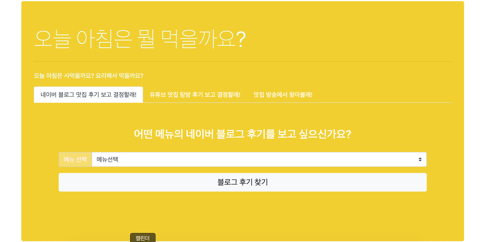
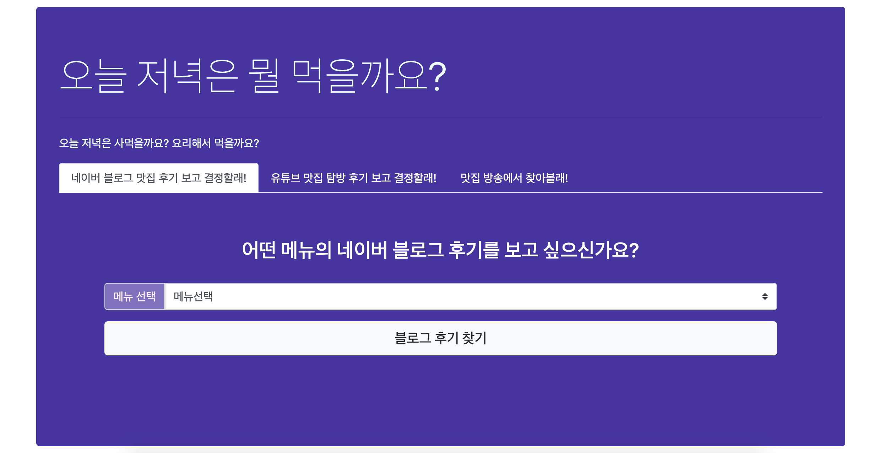
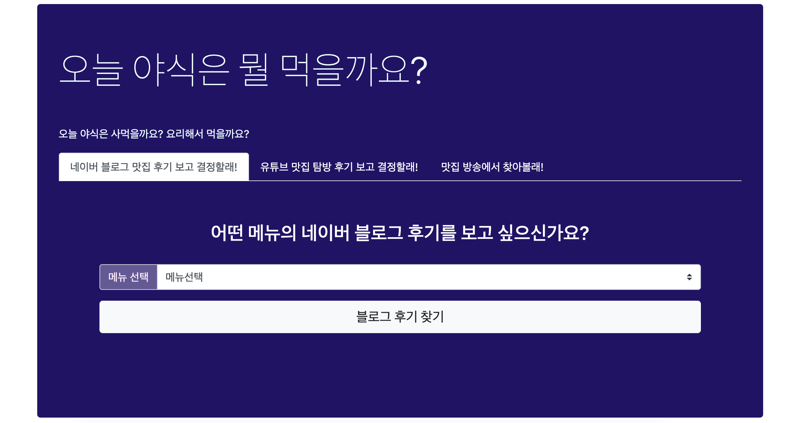

# 스파르타 8기 프로젝트

> [프로젝트 사이트 방문하기 - 오늘은 뭐먹을까?](http://ek12mv2.shop)

> 진행기간: 2020.06.14 ~ 2020.07.03

> 사용언어: python3, html, css, javascript(+ajax)

> 사용기술스택
- server
  - AWS EC2
  - Mongo db (NoSQL)
  - web crawling & scraping (BeautifulSoup, selenium)
  
- client page
  - bootstrap
  - API 및 웹서비스 사용
    - [네이버 블로그 검색 API](https://developers.naver.com/docs/search/blog/)
    - [카카오 맵 지도 검색결과 바로가기 URL (따로 API키 발급없이 이용가능)](https://apis.map.kakao.com/web/guide/#whatlibrary)
    - [구글 유튜브 스크래핑 API]()
        - [참고 URL](https://blog.naver.com/doublet7411/221511344483)

<br>

<hr>


## 오늘은 뭐먹을까?

> 기능 설명

### 1. 시간대별로 식사시간(아침/점심/저녁/야식)을 다르게 표현했고, 컴포넌트의 색상을 다르게 했습니다.

- DOM 안에 있는 모든 페이지의 랜더링이 완성됐을 때 실행하도록 했습니다.
- 먼저 현재 시각을 구하여, ajax를 이용하여 웹서버에게 `/now` 라는 url 에 해당하는 페이지를 요청합니다.
- POST방식이므로, 현재시각 데이터를 서버에게 전달합니다.
  - GET방식과 다르게, POST방식은 url에 전달한 데이터를 노출시키지 않습니다.
  - 서버는 현재시각 데이터에 따라 식사유형(아침/점심/저녁/야식)을 결정하고, 요청에 대한 응답데이터로 클라이언트에게 전달합니다.
  
- 페이지 요청이 성공하게되면 ajax의 success 영역에 해당하는 함수를 실행합니다.
- 따라서, 현재 시각의 시간(hour)에 따른 식사유형(아침/점심/저녁/야식) 결정과, 식사유형에 따른 컨테이너 컴포넌트의 색상을 결정했습니다.










<br>

- front end (jquery와 ajax를 이용했고, POST방식으로 웹서버에게 요청했습니다.)

```javascript
// 현재 시각을 구한다. //
// 현재시각을 구하여, 아침/점심/저녁/야식 으로 구분. => 시간대별로 색깔이 달라짐.
function getCurrentTime() {
    let currentDate = new Date();
    let hour = currentDate.getHours();

    //현재 시각에 따라서 나타낸다
    $.ajax({
        type: 'POST',
        url: '/now',
        data: { 'give_time': hour },
        success: function (response) {
            //페이지 요청이 성공하면, 이에대한 응답함수
            if (response['result'] == 'success') {
                let mealTime = response['meal_time'];
                let sayhi1 = $('#sayHi1');
                let sayhi2 = $('#sayHi2');
                let sayhi3 = $('#sayHi3');

                sayhi1.text(`오늘 ${mealTime}은 뭘 먹을까요?`);
                sayhi2.text(`오늘 ${mealTime}은 사먹을까요? 요리해서 먹을까요?`);
                sayhi3.text(`오늘 ${mealTime}은 이거 어때요?`);

                // mealTime : 아침/점심/저녁/야식 에 따라서 container 배경색깔이 달라짐
                let mainContainer = $('#main_container');
                let searchContainers = $('#search_result_container');
                let footer = $('#footer');
                let colorVal;


                //메인페이지 백그라운드 컬러가 시간대에 따라 달라진다.
                if (mealTime == '아침') {
                    colorVal = "#f2d00c";

                } else if (mealTime == '점심') {
                    colorVal = '#31d7f5';

                } else if (mealTime == '저녁') {
                    colorVal = '#472fa1';
                } else { //야식
                    colorVal = '#210e66';
                }
                mainContainer.css('background-color', colorVal, opacity = 0.5);
                searchContainers.css('background-color', colorVal, opacity = 0.5);
                footer.css('background-color', colorVal, opacity = 0.5);

            }
        }
    });
}

```

<br>

- back end
  - front end단에서 요청에 대한 서버의 응답코드를 구현했습니다.

```python
# 시간대별로 아침/점심/저녁/야식 로 나타낸다.
@app.route('/now', methods=['POST'])
def get_now():
    receive_time = int(request.form['give_time'])
    meal_time = None

    # 5시 ~ 11시 : 아침
    if(receive_time >= 5 and receive_time <= 11):
        meal_time = '아침'
    elif(receive_time >= 12 and receive_time <= 16):
        meal_time = '점심'
    elif(receive_time >= 17 and receive_time <= 21):
        meal_time = '저녁'
    elif((receive_time >= 22 and receive_time < 24) or (receive_time >= 0 and receive_time < 5)):
        meal_time = '야식'

    return jsonify({'result': 'success', 'meal_time': meal_time})

```


<br>

<br>

### 2. 네이버 블로그 맛집 후기보고 결정할래! 구현


- front end

```javascript
function searchNaverBlogs() {
    // 선택한 메뉴 가져오기
    let selectMenu= $('#inputGroupSelect_blog option:selected').val();
    
    console.log('클라이언트가 선택한 메뉴: ', selectMenu);
    $.ajax({
        type: "POST",
        url: '/search/blogs/restaurant',
        data: { 'give_menu': selectMenu }, //옵션에서 선택한 메뉴를 서버에게 전달.
        success: function (response) {
            console.log(response);
            //데이터 요청이 성공하면..
            if(response['result']=='success'){

                //응답영역
                let blogs=response['blogs'];

                console.log(blogs);
                //검색결과 컨테이너를 보이게한다.
                let cardBox = $('#card-box');

                //기존에 있는 데이터를 지운다.
                cardBox.empty();

                blogs.forEach( blog => {
                    
                    // 블로그에 있는 값을 가져온다.
                    let title = blog['title'];
                    let author= blog['author'];
                    let url=blog['url'];
                    let menu=blog['menu'];

                    let card=`<div class="col mb-4">
                                <div class="card">
                                    <a href="${url}" class="blog_post_link">
                                        <div class="card-body">
                                            <h5 class="card-title">${title}</h5>
                                            <p class="card-text">${author}</p>
                                            <hr class="my-4">
                                            <p class="card-text"><small class="text-muted">${menu}</small></p>
                                        </div>
                                    </a>
                                </div>
                            </div>`;
                    // 카드 박스에 카드를 넣는다.
                    cardBox.append(card);
                });

                //검색결과 컨테이너를 보이게한다.
                $('#search_result_container').show();
            }
        }
    });
}

```


- back end

```python
# 네이버 블로그 맛집 후기 보고 결정할래! #
# 메뉴선택에서 선택한 메뉴에 대한 데이터베이스 정보를 가져온다.
@app.route('/search/blogs/restaurant', methods=['POST'])
def search_blogs_data():
    # 클라이언트로부터 받은 메뉴데이터
    select_menu=request.form['give_menu']
    print(select_menu)

    
    if(select_menu=='메뉴선택'):
        # 모든 메뉴의 결과를 가져온다.
        blogs=list(db.naver_blogs.find({}))
    else:
        #몽고디비에서 선택한 메뉴와 관련된 블로그를 찾는다.
        # mongodb 의 _id, menu를 제외한 나머지 필드를 가져온다.
        blogs=list(db.naver_blogs.find({'menu':select_menu}, {'_id':False}))
        
    print(len(blogs))

    return jsonify({'result':'success', 'blogs': blogs})

```

<br>


### 3. 유튜브 맛집 탐방 후기를 보고 결정할래! 구현


<br>

<br>


### 4. 맛집 방송에서 찾아볼래! 구현

- 생생정보통, 생방송 투데이 : bs4(BeautifulSoup)를 이용하여 web-scraping
- 생활의 달인: 크롬브라우저 엔진을 이용하여 selenium과 bs4를 이용한 web-scraping

- front end

```javascript
// 생활의달인 클릭
function flavorMaster() {
    $.ajax({
        type: "GET",
        url: '/search/famous/flavor/master',
        data: {},
        success: function (response) {
            if (response['result'] == 'success') {
                //검색결과 컨테이너를 보이게한다.
                let cardBox = $('#card-box');

                //기존에 있는 데이터를 지운다.
                cardBox.empty();

                //검색결과 식당
                restaurants = response['restaurants'];
                restaurants.forEach(restaurant => {
                    let img_src = restaurant['img_url']; //이미지 정보
                    let name = restaurant['name']; //가게이름
                    let address = restaurant['address']; //가게주소
                    let menu = restaurant['menu']; //메뉴

                    let card = `
                    <div class="col mb-4">
                        <div class="card">
                            
                            <div class="card-body">
                                <h5 class="card-title">${name}</h5>
                                <hr class="my-4">
                                <a href="https://map.kakao.com/link/search/${address}"><p class="card-text">${address}</p></a>
                                <p class="card-text"><small class="text-muted">${menu}</small></p>
                            </div>
                        </div>
                    </div>`;

                    cardBox.append(card);
                });

                //검색결과 컨테이너를 보이게한다.
                $('#search_result_container').show();
            }
        }
    });
}
```

<br>

- back end

```python
# 생활의 달인 - 맛의 달인
@app.route('/search/famous/flavor/master', methods=['GET'])
def find_famous_master():
    # selenium 을 활용한 web page crawling
    options = webdriver.ChromeOptions()
    options.add_argument('headless')
    options.add_argument('disable-gpu')
    driver = webdriver.Chrome('./chromedriver', chrome_options=options)
    
    driver.get('http://matstar.sbs.co.kr/program.html?programs=S01_V0000305532')

    # Beautiful soup를 이용하여, 내가원하는 부분을 웹스크래핑
    html = driver.page_source
    soup = BeautifulSoup(html)
    proList = soup.select('ul.restaurant_list > div')

    restaurants = []
    for pro in proList:
        try:
            img_url = pro.select_one('div > li.rl_cont > div > a > div.box_module_image_w > img.box_module_image')
            name = pro.select_one('div > li.rl_cont > div > a > div.box_module_cont > div > strong')
            menu = pro.select_one('div > li.rl_cont > div > a > div.box_module_cont > div > div > div.mil_inner_kind > span.il_text')
            address = pro.select_one('div > li.rl_cont > div > a > div.box_module_cont > div > div > div.mil_inner_spot > span.il_text')

            data = {
                'img_url': img_url['src'],
                'name': name.text,
                'menu': menu.text,
                'address': address.text
            }

            restaurants.append(data)
        except Exception as e:
            print('exception occurred=> ', pro, '\n=>', e)

    print('생활의달인 - 오늘의 맛집페이지 스크래핑 완료!')
    driver.close()
    driver.quit()
    return jsonify({'result': 'success', 'restaurants': restaurants})

```


<br>

<hr>

## 느낀점 및 소감

- 처음으로 Nosql(mongo db), JSON, Ajax, Jquery, 도메인 연결, AWS EC2, 가상환경 등을 경험했습니다.
- 웹 서비스의 기본적인 골격과 클라이언트의 요청방식에 따라 데이터가 어떻게 흘러가는지, 서버가 어떻게 데이터를 처리하는지를 실제로 코딩을 하면서 배웠습니다.
  - 덤으로 예전에는 어려워서 시도하지 못했던 자바스크립트, ajax, jquery를 얻었습니다.

- 어려웠던 점
  - mongodb와 클라이언트 와 서버 사이에서 데이터를 어떤 과정을 거쳐서 처리하는 방식을 이해하는데 시간이 걸렸습니다.
  - 웹페이지의 컴포넌트 배치가 어려웠습니다. 내가 생각하는 것과 다른 배치 결과가 나오거나 코드 반영이 안됐을 때 당황스러웠습니다.
    - 이럴때는 display때문인가? 컴포넌트의 padding과 margin을 적용해볼까 가설을 세워서 적용을 하거나
    - 가설이 일치하지 않은 경우나 떠오르지 않은 경우에는 구글링을 했습니다.
    
    
  - 스스로 만들어가면서 코딩을 했을 때, 예기치 못한 에러를 해결하는데 시간이 걸렸습니다.
    - 서버에서 발생하는 에러는 VS-code 콘솔창에서 찍히고, 클라이언트에서 발생하는 에러는 크롬의 개발자도구 콘솔창에서 볼 수 있습니다.
    - 예기치 못한 에러가 실제로는 배운범위 내에서와 비슷한 에러라는 것을, 모양만 다를뿐 본질은 같다는 것을 직접 코딩을 하면서, 부딪쳐가면서 경험했습다.
    - 스파르타 코딩클럽에서 배운 범위의 밖의 문제를 경험했는데, 혼자서 고민이 안될 때는 튜터님께 질문을 하거나, 검색을 통해서 해결을 했습니다. 
  
  
  - (문제해결 1) ajax를 이용하여 클라이언트가 서버에게 리스트를 전달했고, 서버가 클라이언트로부터 리스트를 받을 때
  - 실제구현 내용
    - 실제 에러사항은, 서버가 클라이언트로부터 전달된 리스트를 받지 못했습니다.
    - 클라이언트에서, 페이지로드가 모두 완료된 상태에서 메뉴 옵션별로 블로그 데이터들을 모아서 리스트로 저장했습니다.
    - 서버가 리스트를 받는 경우는, 텍스트 한 개를 받는 경우와 다르게 request.form에서 그치지 않고, `request.form.getlist()`를 사용해야하고,  
      전달받은 데이터가 리스트라는 것을 표현하기 위해서 매개변수 안에 `[]`을 붙여야 합니다.

    ```python
    # 네이버 블로그 데이터를 계속 업데이트 하도록한다.
    @app.route('/update/blog', methods=['POST'])
    def update_blog_data():
      #클라이언트쪽에서 서버로 전달한 데이터(메뉴리스트)를 받는다.
      menus_receive= request.form.getlist('menus_give[]')

      print(menus_receive)

      # 0번에 해당하는 옵션은 '메뉴선택'이므로 키워드에 알맞는 블로그 검색에 제외된다.
      # 1번부터 마지막에 해당하는 메뉴옵션만을 collect_naver_blogs 의 update_db_data()함수를 호출
      update_db_data(menus_receive[1:]) #업데이트 모두 완료.
      return jsonify({'result': 'success'})
    ```
    
    
    
  - (문제해결 2) 웹페이지 스크래핑을 했을 때 발생하는 예외처리

        
        
