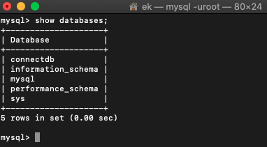
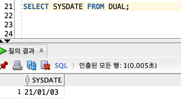

> # Database & DBMS

- DBMS 는 `Database Management System` 의 약자이다.

<br>

실생활과 연관지어서 개념을 이해해보자.

특히 데이터베이스와 DBMS를 도서관과 연결하면 이해하기 쉽다.

|DB & DBMS|도서관|
|:--:|:--:|
|데이터|책|
|데이터베이스|책장|
|DBMS|도서관 사서|

<hr>

> # Database


## 정의

- 데이터의 집합 (A set of a Data)
- 여러 응용시스템(프로그램)들의 통합된 정보들을 운영할 수 있는 공용 데이터 집합
- 저장, 검색, 갱신에 효율적이다.
- 데이터 집합들끼리 연관시키고 조직화되어있음.

<br>

## 특성

- 실시간 접근성
- 계속되는 변화
- 동시 공유성
- 내용참조


<hr>

> # DBMS(Database Management System)

## 정의

- 데이터베이스를 관리하는 소프트웨어.
- 여러 응용소프트웨어(프로그램) 또는 시스템이 동시에 데이터베이스에 접근하여 사용가능.

<br>

## 특징

- **정의기능** : 논리적, 물리적 구조를 정의
- **조작기능** : 데이터 검색, 삭제, 갱신, 삽입 기능.
- **제어기능** : 정확성과 안정성을 유지하도록 제어

- DBMS는 `mysql`, `oracle`, `db2`, `mariadb` 등이 있다.

<hr>

> # SQL (Structured Query Language)

## 정의

- 데이터를 보다 쉽게 검색, 추가, 삭제, 수정 같은 조작을 할 수 있는 고안된 컴퓨터 언어.

- 관계형 데이터베이스에 데이터를 조작

- **DML**(Data Manipulation Language)
  - 정의: 데이터를 조작
  - **SELECT** : 검색
  - **INSERT** : 추가
  - **DELETE** : 삭제
  - **UPDATE** : 갱신

- **DDL**(Data Definition Language)
  - 정의: 데이터베이스 스키마를 정의 및 조작
  - **CREATE**
  - **DROP**
  - **ALTER**

- **DCL**(Data Control Language)
  - 정의: 데이터를 제어
  - **GRANT**
  - **REVOKE**
  - **COMMIT**
  - **ROLLBACK**


- **스키마(scheme)**
  - 관계형 데이터베이스의 테이블(릴레이션)이 어떻게 구성되는지, 어떤정보를 담고있는지에 대한 **기본적인 구조** 를 의미한다.

<br>

<hr>

<br>

> # mysql 설치 및 시작하기

## - MySQL 설치하기 (macOS)

```shell
$ brew -v

$ brew install mysql
```

<br>

## - MySQL 시작하기

```shell
$ mysql.server start
```

<br>

## - 관리자 계정으로 접속하기

```shell
$ mysql -uroot
```

<br>

<hr>

## (MySQL) DB 생성하기

- 코드

```sql
CREATE DATABASE 데이터베이스이름;
```

- 사용예시 : **`connectdb`** 이름의 데이터베이스 생성하기.


```sql
CREATE DATABASE connectdb;
```

<br>


<br>

## (MySQL) 데이터베이스 조회하기

```sql
SHOW DATABASES;
```

<BR>



<br>

## (MySQL) 버젼확인

```sql
SELECT VERSION();
```

<br>


<br>

## (MySQL) 사용자 계정 생성하기

- 사용 예시: connectuser 계정 생성하기
- 조건
  - 계정이름은 connectuser이고, 비밀번호는 `connect123!@#` 이다.

```sql
CREATE USER connectuser@localhost IDENTIFIED BY 'connect123!@#';
```

<br>


<br>

## (MySQL) 사용자 계정한테 권한부여하기

```sql
GRANT ALL PRIVILEGES ON 데이터베이스이름.* TO 계정이름 @'%'IDENTIFIED BY '계정암호';
```

<br>

- 사용예시
  - `GRANT ALL PRIVILEGES ON connectdb.*`: connectdb 테이블에대한 모든권한을 준다.

  - `TO connectuser`: 계정이름이 `connectuser`은 root로부터 테이블을 관리할 수 있는 권한을 받는다.

  - `'localhost'`: 로컬호스트(내 컴퓨터)에서 접근이 가능하다.


```sql
GRANT ALL PRIVILEGES ON connectdb.* TO connectuser@'localhost';

FLUSH PRIVILEGES;
```

<br>


<br>

## 종료하기

```sql
quit
```

<br>

```sql
exit
```

<br>


<br>

## 등록한 사용자계정으로 접속하기

```shell
mysql -h127.0.0.1 -uconnectuser -p connectdb
```


<br>

## 현재 날짜 출력하기

- MySQL

```sql
SELECT CURRENT_DATE;
```


<br>

```sql
SELECT NOW();
```


<BR>

- Oracle

```sql
SELECT SYSDATE FROM DUAL;
```



<br>

## 사용중인 데이터베이스 전환하기

```sql
USE DB이름;
```


<br>

## 테이블 조회하기

```sql
SHOW TABLES;
```

<BR>

<hr>

<br>

> # Oracle

## 계정생성 및 권한 부여하기

- 루트계정(SYSTEM)으로 접속합니다.

<br>

## - 계정 생성

```sql
CREATE USER 계정이름 IDENTIFIED BY 계정암호;
```

<br>

## - 권한부여

```sql
-- 자원관리, 연결 권한을 '계정이름' 에게 부여한다.
GRANT RESOURCE, CONNECT TO 계정이름;

-- 뷰생성권한을 '계정이름' 에게 부여한다.
GRANT CREATE VIEW TO 계정이름;
```

<br>

- ORACLE 계정생성 및 권한부여 예시코드

```sql
CREATE USER TRIP2REAP identified by TRIP2REAP;

-- 자원, 연결 권한 부여
GRANT RESOURCE, CONNECT TO TRIP2REAP;

-- 뷰작성 권한 부여
GRANT CREATE VIEW TO TRIP2REAP;

-- SYNONYM 작성권한 부여
GRANT CREATE SYNONYM TO TRIP2REAP;
```
