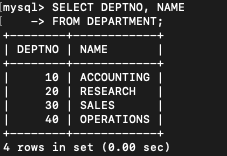
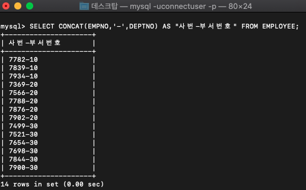
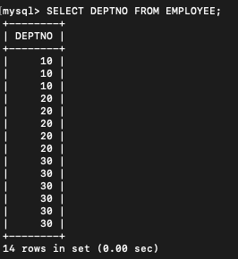

> # DML

## 시작하기전, 셋팅하기

```shell
mysql -uconnectuser -p connectdb < examples.sql
```

<br>

```sql
show tables
```

<br>


<br>

> # 1. SELECT

```SQL
SELECT *
FROM DEPARTMENT;
```


<br>

```sql
SELECT DEPTNO, NAME
FROM DEPARTMENT;
```



<BR>

> ## 테이블에 구성하는 컬럼값 확인하기 (DESC)

```sql
DESC 테이블이름;
```


<br>

> ## ALIAS(별칭)

```sql
SELECT DEPTNO "부서번호", NAME "부서명", LOCATION AS 지역
FROM DEPARTMENT;
```


<BR>

## CONCAT - 문자열을 결합시키는 함수

```sql
SELECT CONCAT(EMPNO,'-',EMPNO) AS 사번-부선번호
FROM EMPLOYEE;
```



<BR>

## DISTINCT - 단일값을 나타내는 함수

<BR>

```SQL
SELECT DEPTNO
FROM EMPLOYEE;
```



<BR><br>

```SQL
SELECT DISTINCT DEPTNO
FROM EMPLOYEE;
```


<BR>

## 정렬하기 - ORDER BY

- 이름을 오름차순 정렬

```SQL
SELECT EMPNO, NAME
FROM EMPLOYEE
ORDER BY NAME;
```

<BR>

- 이름을 내림차순으로 정렬

```sql
SELECT EMPNO, NAME
FROM EMPLOYEE
ORDER BY NAME DESC;
```

<BR>

## WHERE 절

```sql
-- EMPLOYEE 테이블에서 고용일이 1981년 이전의 사원이름과 고용일을 출력
SELECT NAME AS 사원이름, HIREDATE "고용일"
FROM EMPLOYEE
WHERE HIREDATE < '1981-01-01';
```

<br>

## IN

```SQL
SELECT *
FROM EMPLOYEE
WHERE DEPTNO IN (10,30);
```


<BR>

## LIKE

- `%` : 0자~ 여러개의 문자열을 나타냄


```SQL
-- 이름이 a로 시작하는 사원의 정보를 출력.
SELECT *
FROM EMPLOYEE
WHERE NAME LIKE 'a%'

-- 이름이 n으로 끝나는 사원
SELECT *
FROM EMPLOYEE
WHERE NAME LIKE '%a'

-- 이름에 a가 포함되어있는 사원.
SELECT *
FROM EMPLOYEE
WHERE NAME LIKE '%a%'
```

- `_` : 1자의 문자를 나타내는 와일드카드.

```sql
-- 이름의 두번째 문자가 a인 사람
-- _에 해당하는 문자는 건너뜀.
SELECT *
FROM EMPLOYEE
WHERE NAME LIKE '_a%'
```


<br>


## UPPER(UCASE), LOWER(LCASE)


<br>


<br>


<BR>

## SUBSTRING

- sql은 시작 인덱스는 1이다.

- 7번인덱스부터 시작하여, 3글자만 출력한다.


<BR>

## LPAD, RPAD

- 남은 공간에 대치 문자를 넣는다.


<br>

## TRIM, LTRIM, RTRIM

- 공백 제거.


<br>

## 다양한 함수들

- `ABS(숫자)` : 절댓값
- `MOD(값, 나누려는값)` : 나눗셈 나머지값
- `FLOOR(x)` : x보다 작은 정수 중 가장 큰 정수
- `CEILING(x)`: x보다 큰 정수 중 가장 작은 정수
- `ROUND(x)` : x에 가장 근접한 정수 (반올림)


<br>

- `POW(x,y)`: x의 y제곱승
- `GREATEST(x,y, ...)` : 가장 큰 값을 반환
- `LEAST(x,y, ...)` : 가장 작은 값을 반환
- `CURDATE()`, `CURRENT_DATE` : 오늘날짜를 `YYYY-MM-DD`형식으로 반환
- `NOW()`, `SYSDATE`, `CURRENT_TIMESTAMP` : 오늘 현시각을 `YYY-MM-DD HH:MM:SS` 형식으로 반환


<BR>

<HR>

> # 2. INSERT

<HR>

> # 3. UPDATE

<HR>

> # 4. DELETE
