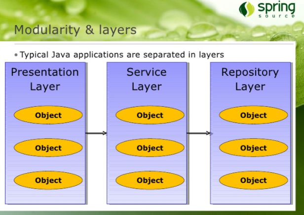

# 레이어드 아키텍쳐 (Layered Architecture)

> ## Controller에서 중복되는 부분을 처리하려면?

- 별도의 객체로 분리
- 별도의 메소드로 분리
- 모든 페이지가 공통 메뉴바(로그인, 회원정보 조회)를 갖는 경우
  - 예를들어서, 쇼핑몰에서
    - 쇼핑몰 게시판에서도 회원정보를 보여주거나
    - 상품목록 보기 페이지에서도 회원정보를 보여줘야할 때
    - 회원정보를 읽어오는 코드를 공통으로 갖게하려면?
      - 컨트롤러를 중복적으로 호출할 경우에는 **서비스**를 이용

 

- **서비스** (Service)
  - 비즈니스 로직(Business Logic)을 수행하는 메소드를 갖는 객체
  - 보통 **하나의 비즈니스 로직은 하나의 트랜잭션으로 동작**한다.
    - **트랜잭션**(Transaction)
      - 정의: 하나의 **논리적인 작업**
      - 트랜잭션의 4가지 특징
        - **원자성**(Atomicity)
          - 전체가 성공하거나 전체가 실패하는 것을 의미한다.
            - rollback :  원래대로 복원
            - commit : 반영

        - **일관성**(Consistency)
          - 트랜잭션 작업 처리 결과가 항상 일관성이 있어야한다.
          - 진행되는 동안 데이터가 변경되더라도, 업데이트된 데이터로 트랜잭션을 진행하는게 아니라 처음 트랜잭션을 진행하기 위해 참조한 데이터로 진행.
        - **독립성**(Isolation)
          - 어느 하나의 트랜잭션이더라도 트랜잭션의 연산을 끼어들 수 없다.
          - 하나의 특정 트랜잭션이 완료될때까지 다른트랜잭션이 특정 트랜잭션의 결과를 참조할 수 없다.
        - **지속성**(Durability)
          - 트랜잭션이 성공적으로 완료되었을 때 결과는 영구적으로 반영.

  - 업무와 관련된 메소드(비즈니스 메소드)를 가짐.
  - 서비스객체를 따로 만들어놓고 여러개의 컨트롤러가 하나의 서비스객체를 사용하도록 설정.

- JDBC 프로그래밍에서 트랜잭션 처리 방법
  - Connection객체의 `setAutoCommit()`를 false로 한다. (setAutoCommit의 기본값은 true로 설정되어있다.)

  - 입력, 수정, 삭제 SQL이 실행한 후에 모두 성공하면 `commit()`메소드를 수행하고, 실패할 경우에는 `rollback()`(원래상태로 복원)메소드를 수행한다.

 

> # @EnableTransactionManagement

- **spring java config 파일에서 트랜잭션을 활성화**할때 사용하는 어노테이션이다.

- java Config를 사용하게 되면 **`PlatformTransactionManager`구현체를 모두 찾아서 그중 하나를 매핑해서 사용** 한다.

- 특정 트랜잭션 매니저를 사용하고자한다면 **`TransactionManagementConfigurer`를 Java Config 파일에서 구현** 하고 **원하는 트랜잭션 매니저를 리턴**하도록한다.

- 특정 트랜잭션 매니저 객체를 생성했을 때는 **@Primary** 어노테이션을 지정한다.

- 서비스 객체에서 중복으로 호출되는 코드의 처리
  - 서비스객체마다  비즈니스 메소드를 갖고있다.
  - 하나의 비즈니스 메소드는 트랜잭션 단위로 작업을 처리할 수있다.
  - 하나의 트랜잭션에는 여러개의 데이터베이스 작업이 수행될 수 있다.
    - 예) 게시글 상세페이지 방문 => 해당 게시글번호가 있는지 확인하여 페이지 이동 + 조회수 증가

  - 비즈니스 메소드마다 중복되는 기능을 호출할 수 있다.
  - 서비스 객체에서 중복되는 기능을 처리할 때, 별도의 객체로 분리하거나 별도의 메소드로 분리해서 사용한다.

  - 데이터 엑세스 메소드를 별도의 Repository(DAO) 객체에서 구현하도록 한다.
  - 서비스는 Repository 객체를 사용하도록 한다.

 

> # Layered Architecture

- Presentation Layer: Controller 객체가 동작
- Service Layer : 비즈니스 메소드를 갖는 서비스 객체동작
- Repository Layer : DB접근, DAO객체를 활용

 

> # 설정의 분리

- Spring 설정파일을 프레젠테이션 레이어쪽과 나머지(Service, Repository)를 분리할 수 있다.

- web.xml 파일에서 프레젠테이션 레이어에 대한 스프링 설정은 DispatcherServlet이 읽도록 한다.

- 프레젠테이션 이외의 설정은 ContextLoaderListener를 통해서 읽도록 한다.
