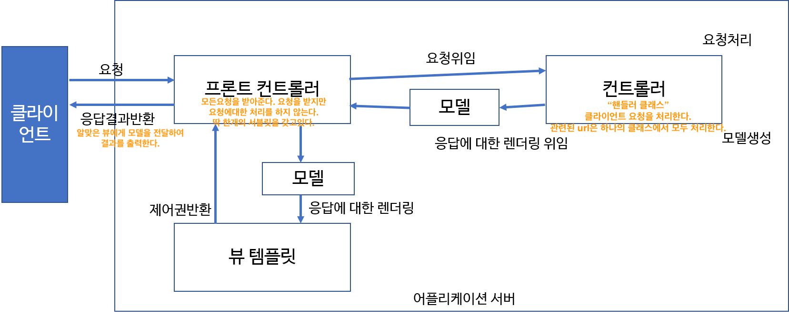
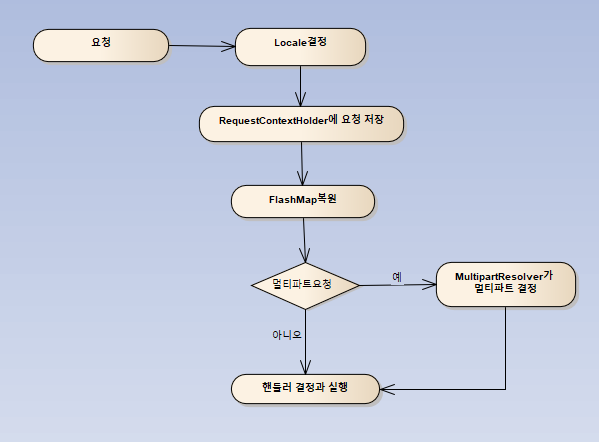
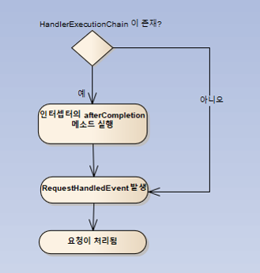

# MVC  (Model View Controller)

**Model**
- 뷰가 랜더링하는데 필요한 데이터.
- 사용자가 요청한 상품목록, 주문내역 등이 해당.

**View**
- 웹 애플리케이션에서 뷰는 실제로 보여주는 부분.
- 모델을 사용하여 랜더링을 한다.

**Controller**
- 사용자의 액션에 응답하는 컴포넌트
- 모델을 업데이트하고 다른 액션을 수행한다.

 

# MVC 모델 - Web Module - Spring MVC

 

# Spring MVC 기본 동작 흐름

- Spring MVC를 이해한다는 것은 DispatcherServlet이 어떻게 요청하는지를 이해해야한다.

 

- 파란색: (DB 제외) 스프링프레임워크가 만들어야 하는 것/ 보라색: 개발자가 만들어야 하는것/ 초록색: 스프링 또는 개발자

- DispatcherServlet
  - 클라이언트로부터 요청을 받는다.
  - 요청을 처리할 메소드와 서블릿이 무엇인지 Handler Mapping한테서 찾는다.

- Handler Mapping
  - 요청을 처리할 메소드와 서블릿을 찾는다.

- Handler Adapter
  - 요청 처리할 메소드와 서블릿을 컨트롤러에서 실행할 수 있도록 한다.
  - 요청 처리후 응답뷰 이름을 리턴받는다.

- DispatcherServlet은 응답뷰 이름으로 어떤 응답화면을 보여줄지를 ViewResolver을 통해서 찾아서 해당 뷰를 클라이언트에게 응답한다.

# DispatcherServlet 내부동작 흐름

- 프론트컨트롤러(Front Controller)
  - 모든요청을 받는다.
  - 요청 처리할 핸들러에게 넘겨서 요청과 관련된 메소드와 서블릿을 찾는다.
  - 핸들러가 처리한 응답 결과를 클라이언트에게 보여준다.
  - 보통 1개만을 사용한다.

- DispatcherServlet
  - 여러 컴포넌트를 이용해 작업을 처리한다.

> ## 요청에 대한 선처리 작업

- Spring MVC는 **지역화**를 지원한다.
  - **지역화**
    - 예) 같은 사이트더라도 사용자의 국적에따라 언어가 다르게 지원되는 경우.

- **RequestContextHolder**
  - HttpServletRequest, HttpServletResponse 를 사용할 수 있다.

- **FlashMap**
  - redirect로 값을 전달할 때 사용한다.
  - 현재 실행이 redirect될 때 값을 유지할 수 있다.

- 사용자가 파일업로드를 했을 때
  - **MultipartResolver**가 multipart 요청을 올때 결정하고, 요청처리 핸들러를 결정.

 

> ### **요청 선처리 작업 시** 사용되는 컴포넌트들

- *org.springframework.web.servlet.LocaleResolver*
  - 지역화
  - 지역정보를 결정해주는 객체
  - default LocalResolver
    - `AcceptHeaderLocalResolver` : HTTP 헤더 정보를 보고 지역정보를 설정한다.

- *org.springframework.web.servlet.FlashMapManager*
  - FlashMap 객체를 조회
  - 저장을 위한 인터페이스
    - `RedirectAttributes`의 **addFlashAttribute()**메소드를 이용하여 저장.
  - 리다이렉트 이후 조회를 하면 정보가 바로 삭제된다.
- *org.springframework.web.context.request.RequestContextHolder*
  - 일반 빈(Bean)에서 `HttpServletRequest`, `HttpServletResponse`, `HttpSession` 등을 사용할 수 있도록 한다.
  - 해당 객체를 일반 빈(Bean)에서 사용하게 되면, Web에 종속된다.

- *org.springframework.web.multipart.MultipartResolver*
  - Multipart 파일 업로드를 처리하는 객체이다.

> ## 요청 전달

- 404번 에러: 없는 페이지 요청

> ### 요청전달시 사용된 컴포넌트

- *org.springfamework.web.servlet.HandlerMapping*
  - HandlerMapping : 요청을 처리할 핸들러에 대한 정보를 의미한다.
  - default HandlerMapping
    - BeanNameHandlerMapping
    - DefaultAnnotationHandlerMapping

- *org.springframework.web.servlet.HandlerExecutionChain*
  - 실제로 호출된 핸들러에 대한 참조를 갖고있다.
  - 요청 처리 실행 메소드가 무엇인지 알고있다.
  - 핸들러 실행전과 핸들러 실행후에 수행될 HandlerInterceptor도 참조하고 있다.

- *org.springframework.web.servlet.HandlerAdapter*
  - 실제 핸들러를 실행하는 역할을 담당
  - 선택된 핸들러를 실행하는 방법과 응답을 **ModelAndView**로 변환하는 방법에 대해 알고있다.
  - default HandlerAdapter
    - HttpRequestHandlerAdapter
    - SimpleControllerHandlerAdapter
    - AnnotationMethodHandlerAdapter
    - `@RequestMapping`, `@Controller` 와 같은 어노테이션으로 정의된 컨트롤러들은 DefaultAnnotationHandlerMapping에 의해 결정.
    - 그에 대응되는 AnnotationMethodHandlerAdapter 에 의해 호출이 일어난다.

> ## 요청처리

> ### 요청처리시 사용되는 컴포넌트

- *org.springframework.web.servlet.ModelAndView*
  - Controller의 처리결과를 보여줄 view와 view에서 사용할 값을 전달하는 클래스
  - 종속되지 않게하기 위해서 ModelAndView를 제공한다.

- *org.springframework.web.servlet.RequestToViewNameTranslator*
  - 컨트롤러에서 뷰이름이나 뷰 오브젝트를 제공해주지 않을 경우 URL과 같은 요청정보를 참고해서 자동으로 뷰이름을 생성해주는 오브젝트이다.
  - DefaultRequestToViewNameTranslator 가 기본이다.

> ## 예외 처리

> ### 예외 처리시 사용되는 컴포넌트

- *org.springfamework.web.servlet.HandlerExceptionResolver*
  - 기본적으로 DispatcherServlet이 DefaultHandlerExceptionResolver를 등록
  - HandlerExceptionResolver는 예외가 발생했을 때 어떤 핸들러를 실행할 것인지에 대한 정보를 제공.

> ## View Rendering

> ### View Rendering시 사용되는 컴포넌트

- *org.springframework.web.servlet.ViewResolver*
  - 컨트롤러가 리턴한 뷰 이름을 참고해서 적절한 뷰 오브젝트를 찾아주는 로직을 가진 객체.
  - 뷰의 종류에 따라 적절한 ViewResolver를 추가로 설정할 수 있다.

> ## 요청 처리 종료

