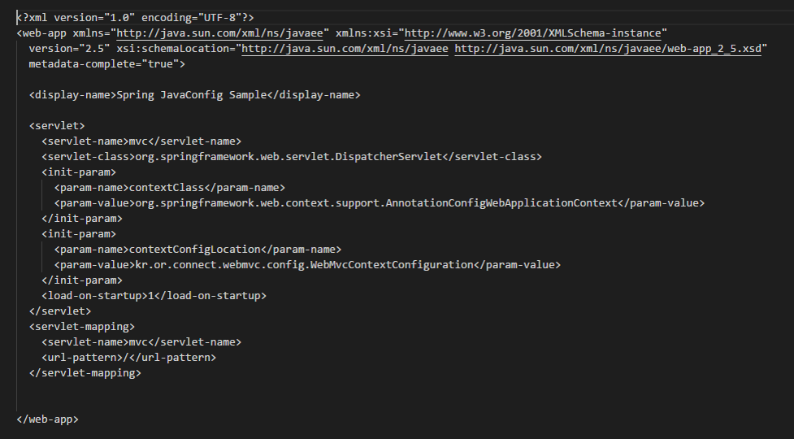

> # Spring MVC 실습 - 프로젝트 세팅

- 프로젝트 세팅
  - Maven 프로젝트
    - GroupId : **org.apache.maven.archetypes**
    - ArtifactId: **maven-archetype-webapp**

<br>

### pom.xml 파일에 라이브러리 추가

```xml
<?xml version="1.0" encoding="UTF-8"?>

<project xmlns="http://maven.apache.org/POM/4.0.0" xmlns:xsi="http://www.w3.org/2001/XMLSchema-instance"
  xsi:schemaLocation="http://maven.apache.org/POM/4.0.0 http://maven.apache.org/xsd/maven-4.0.0.xsd">
  <modelVersion>4.0.0</modelVersion>

  <groupId>com.exam.boostcourse</groupId>
  <artifactId>mvcExam</artifactId>
  <version>0.0.1-SNAPSHOT</version>
  <packaging>war</packaging>

  <name>mvcExam Maven Webapp</name>
  <!-- FIXME change it to the project's website -->
  <url>http://www.example.com</url>

  <properties>
    <project.build.sourceEncoding>UTF-8</project.build.sourceEncoding>
    <maven.compiler.source>1.7</maven.compiler.source>
    <maven.compiler.target>1.7</maven.compiler.target>
    <spring.version>5.2.12.RELEASE</spring.version>
  </properties>

  <dependencies>
    <dependency>
      <groupId>junit</groupId>
      <artifactId>junit</artifactId>
      <version>4.11</version>
      <scope>test</scope>
    </dependency>

    <!--(spring context) spring-context -->
    <!-- https://mvnrepository.com/artifact/org.springframework/spring-context -->
	<dependency>
	    <groupId>org.springframework</groupId>
	    <artifactId>spring-context</artifactId>
	    <version>${spring.version}</version>
	</dependency>

    <!--(spring web mvc) spring-webmvc  -->
    <dependency>
	    <groupId>org.springframework</groupId>
	    <artifactId>spring-webmvc</artifactId>
	    <version>${spring.version}</version>
	</dependency>

    <!-- JSTL : jstl-->
    <!-- https://mvnrepository.com/artifact/javax.servlet/jstl -->
	<dependency>
	    <groupId>jstl</groupId>
	    <artifactId>jstl</artifactId>
	    <version>1.2</version>
	</dependency>

    <!-- JSP : javax.servlet.jsp-api -->
    <!-- https://mvnrepository.com/artifact/javax.servlet.jsp/javax.servlet.jsp-api -->
	<dependency>
	    <groupId>javax.servlet.jsp</groupId>
	    <artifactId>javax.servlet.jsp-api</artifactId>
	    <version>2.3.3</version>
	    <scope>provided</scope>
	</dependency>


    <!--  Servlet : javax.servlet-api -->
    <!-- https://mvnrepository.com/artifact/javax.servlet/javax.servlet-api -->
	<dependency>
	    <groupId>javax.servlet</groupId>
	    <artifactId>javax.servlet-api</artifactId>
	    <version>3.1.0</version>
	    <scope>provided</scope>
	</dependency>


  </dependencies>

  <build>
    <finalName>mvcExam</finalName>
    <pluginManagement><!-- lock down plugins versions to avoid using Maven defaults (may be moved to parent pom) -->
      <plugins>
        <plugin>
          <artifactId>maven-clean-plugin</artifactId>
          <version>3.1.0</version>
        </plugin>
        <!-- see http://maven.apache.org/ref/current/maven-core/default-bindings.html#Plugin_bindings_for_war_packaging -->
        <plugin>
          <artifactId>maven-resources-plugin</artifactId>
          <version>3.0.2</version>
        </plugin>


        <!-- maven-compiler-plugin 라이브러리 -->
        <plugin>
          <artifactId>maven-compiler-plugin</artifactId>
          <version>3.8.0</version>
          <configuration>
          	<source>1.8</source>
          	<target>1.8</target>
          </configuration>
        </plugin>


        <plugin>
          <artifactId>maven-surefire-plugin</artifactId>
          <version>2.22.1</version>
        </plugin>
        <plugin>
          <artifactId>maven-war-plugin</artifactId>
          <version>3.2.2</version>
        </plugin>
        <plugin>
          <artifactId>maven-install-plugin</artifactId>
          <version>2.5.2</version>
        </plugin>
        <plugin>
          <artifactId>maven-deploy-plugin</artifactId>
          <version>2.8.2</version>
        </plugin>
      </plugins>
    </pluginManagement>
  </build>
</project>

```


<br>

### Dynamic Web Module 3.1버젼으로 설정하기

- Navigator > .settings > **org.eclipse.wst.common.project.facet.core.xml** 수정
  - `facet="jst.web"`의 `version`을 **3.1**로 변경한다.

```xml
<?xml version="1.0" encoding="UTF-8"?>
<faceted-project>
  <fixed facet="wst.jsdt.web"/>
  <installed facet="jst.web" version="3.1"/>
  <installed facet="wst.jsdt.web" version="1.0"/>
  <installed facet="java" version="1.8"/>
</faceted-project>

```


- 프로젝트 마우스 오른쪽 클릭 > Properties > Project Facets 에서..
  - **Dynamic Web Module**의 version을 **3.1**로 설정한다.
  - Java 버젼이 **1.8**인지 확인한다.


<br>

> # DispatcherServlet을 FrontController로 설정하기

- DispatcherSerlvet은 웹 애플리케이션에서 FrontController와 같은 역할을하지만, *DispatcherServlet이 FrontController역할을 하도록 설정*을 해야한다.
  - (✔️ 방법1) **web.xml 파일에 설정한다.**
    - KH정보교육원 프로젝트 방법..

  - (방법2) **javax.servlet.ServletContainerInitilizer을 사용**
  - (✔️ 방법3) **org.springframework.web.WebApplicationInitilizer 인터페이스를 구현해서 사용**
    - 실행하는데 시간이 걸린다.
    - Spring MVC는 ServletContainerInitilizer를 구현하고 있는 `SpringServletContainerInitializer`를 제공한다.
    - `SpringServletContainerInitializer`는 WebApplicationInitilizer구현체를 찾아 인스턴스를 만들고 해당 인스턴스의 `onStartup()`메소드를 호출하여 초기화한다.

<br>

### (방법1) web.xml 파일에서 DispatcherSerlvet 설정하기 - 실습에 이용할 방법



- (예시) TRIP2REAP 전국방방곡곡 프로젝트 중 web.xml파일의 일부

```xml
<?xml version="1.0" encoding="UTF-8"?>
<web-app version="2.5" xmlns="http://java.sun.com/xml/ns/javaee"
	xmlns:xsi="http://www.w3.org/2001/XMLSchema-instance"
	xsi:schemaLocation="http://java.sun.com/xml/ns/javaee https://java.sun.com/xml/ns/javaee/web-app_2_5.xsd">

	<!-- The definition of the Root Spring Container shared by all Servlets and Filters -->
	<context-param>
		<param-name>contextConfigLocation</param-name>
		<param-value>
		    classpath:root-context.xml
		    /WEB-INF/spring/spring-security.xml
		    </param-value>
	</context-param>

	<!-- Creates the Spring Container shared by all Servlets and Filters -->
	<listener>
		<listener-class>org.springframework.web.context.ContextLoaderListener</listener-class>
	</listener>

	<!-- DispatcherServlet -->
	<servlet>
		<servlet-name>appServlet</servlet-name>
		<servlet-class>org.springframework.web.servlet.DispatcherServlet</servlet-class>
		<init-param>
			<param-name>contextConfigLocation</param-name>
			<param-value>/WEB-INF/spring/appServlet/servlet-context.xml</param-value>
		</init-param>
		<load-on-startup>1</load-on-startup>
	</servlet>

	<servlet-mapping>
		<servlet-name>appServlet</servlet-name>
		<url-pattern>*.do</url-pattern>
	</servlet-mapping>

	<!-- 공용 에러 페이지 등록  -->
	<error-page>
	    <exception-type>java.lang.Exception</exception-type>
	    <location>/WEB-INF/views/common/errorPage.jsp</location>
	</error-page>

	<!-- 회원관련 서블릿 -->
	<servlet>
	    <servlet-name>memberServlet</servlet-name>
	    <servlet-class>org.springframework.web.servlet.DispatcherServlet</servlet-class>
	    <init-param>
	        <param-name>contextConfigLocation</param-name>
	        <param-value>/WEB-INF/spring/appServlet/member-context.xml</param-value>
	    </init-param>	    
	</servlet>
	<servlet-mapping>
	    <servlet-name>memberServlet</servlet-name>
	    <url-pattern>*.me</url-pattern>
	</servlet-mapping>


	<!-- 호텔관련 서블릿 -->
	<servlet>
		<servlet-name>hotelServlet</servlet-name>
		<servlet-class>org.springframework.web.servlet.DispatcherServlet</servlet-class>
		<init-param>
			<param-name>contextConfigLocation</param-name>
			<param-value>/WEB-INF/spring/appServlet/hotel-context.xml</param-value>
		</init-param>
	</servlet>
	<servlet-mapping>
		<servlet-name>hotelServlet</servlet-name>
		<url-pattern>*.ho</url-pattern>
	</servlet-mapping>
</web-app>
```

<br>

<hr>

> ### `WebMvcContextConfiguration.java`

- DispatcherServlet은 해당설정파일을 읽어서 내부적으로 Spring컨테이너인 ApplicationContext를 생성한다.

- WebMvcContextConfiguration.java (Spring ver 4.x까지만 가능.)

```java
@Configuration
@EnableWebMvc
@ComponentScan(basePackages={"kr.or.connect.webmvc.controller"})
public class WebMvcContextConfiguration extends WebMvcConfigurerAdapter{
  ...
}
```

- WebMvcContetConfiguration.java (Spring version 5이상일 때)
  - 버젼 5이상일때는 `WebMvcConfigurerAdapter`가 deprecated됨.
  - [참고 자료 - Warning: The type WebMvcConfigurerAdapter is deprecated](https://www.baeldung.com/web-mvc-configurer-adapter-deprecated)

```java
@Configuration
@EnableWebMvc
@ComponentScan(basePackages={"kr.or.connect.webmvc.controller"})
public class WebMvcContextConfiguration implements WebMvcConfigurer{
  ...
}
```


<br>

> ### `@Configuration`

- **설정 파일(java config 파일)임을 알려준다.**
- `org.springframework.context.annotation`의 `@Configuration`과 `@Bean` 코드를 이용하여 스프링 컨테이너에 새로운 Bean객체를 제공할 수 있다.

<br>

> ### `@EnableWebMvc`

- **웹에 필요한 빈들을 자동으로 설정해준다.**
- DispaterServlet의...
  - RequestMappingHandlerMapping
  - RequestMappingHandlerAdapter
  - ExceptionHandler
  - ExceptionResolver
  - MessageConverter

- 기본설정 이외의 파일이 필요하다면 `WebMvcConfigurerAdapter` 를 상속받도록 Java Config Class를 작성한 후, 필요한 메소드를 오버라이딩하도록 한다.

- [상세히 파헤쳐보기 - WebMvcConfigurationSupport.java 코드 뜯어보기.](https://github.com/spring-projects/spring-framework/blob/master/spring-webmvc/src/main/java/org/springframework/web/servlet/config/annotation/WebMvcConfigurationSupport.java)

<br>

> ### `@ComponentScan`

- `basePackages`에 기재된 패키지범위에서 `@`이 붙은 클래스를 찾아서 스프링 컨테이너가 관리하도록 한다.
  - `@Controller`
  - `@Repository`
  - `@Component`
  - `@Service`

- `DefaulAnnotationHandlerMapping` 과 `RequestMappingHandlerMapping` 구현체는 다른 핸들러 매핑보다 훨씬 더 정교한 작업을 수행한다.
  - 어노테이션을 사용하여 매핑관계를 찾는다.
  - 스프링 컨테이너(application context)에 있는 요청 처리 빈(bean)에서 RequestMapping 어노테이션을 클래스나 메소드에서 찾아 HandlerMapping객체를 생성하게 된다.
    - `HandlerMapping`은 서버로 들어온 요청을 어느 핸들러로 전달할지 결정하는 역할을 갖는다.
  - `DefaultAnnotaionHandlerMapping`은 `DispatcherServlet`이 기본으로 등록한 기본 핸들러 매핑 객체이다.
  - `RequestMappingHandlerMapping`은 더 강력하고 유연하지만 사용하려면 명시적으로 설정해야한다.

<br>

- WebMvcConfigurerAdapter
  - org.springframework.web.servlet.config.annotation.WebMvcConfigurerAdapter
  - `@EnableWebMvc`를 이용하면 기본적인 설정이 모두 자동으로 되지만, **기본 설정 이외의 설정이 필요할 경우**에는 **해당 클래스(WebMvcConfigurerAdapter)를 상속받은 후에 메소드를 오버라이딩하여 구현한다.**


<br>

> ### `@Controller`

- 요청을 처리하는 클래스임을 알려준다.
- @ComponentScan에게 알려서 spring 컨테이너가 관리할 수있도록한다.
- **url을 요청했을 때 어떤 컨트롤러에서, 어떤 메소드에서 처리를 해야될지를 알아내려면 `@RequestMapping` 어노테이션을 사용해야한다.**
  - 예) 호텔리스트를 조회에 대한 요청을 보낼때("hotelList.ho") => "hotelList.ho" 에 매핑된(`@RequestMapping("hotelList")`가 붙은) 메소드를 불러온다.


<br>

> ### `@RequestMapping`

- URL패턴 지정과 같다.
- 요청을 할때, 어떤 메소드가 요청을 처리할지를 알려주는 역할.
- HTTP 요청과 이를 다루기 위한 Controller의 메소드를 연결하는 어노테이션

- #### (1) Http Method와 연결하는 방법
  - @RequestMapping("/users", method=RequestMethod.POST)
  - Spring 4.3 ver 이후부터 5가지 매핑을 사용할 수 있다.
    - @GetMapping
    - @PostMapping
    - @PutMapping
    - @DeleteMapping
    - @PatchMapping


- #### (2) Http 특정 header와 연결하는 방법
  - @RequestMapping(method= RequestMethod.GET, headers="content-type=application/json")

- #### (3) Http Parameter와 연결하는 방법
  - @RequestMapping(method=RequestMethod.GET, params="type=raw")


- #### (4) Content-Type Header과 연결하는 방법
  - @RequestMapping(method=RequestMethod.GET, consumes="application/json")

- #### (5) Accept Header 과 연결하는 방법
  - @RequestMapping(method=RequestMethod.GET, produces="application/json")

<br><br>

<hr>

> # 실습
